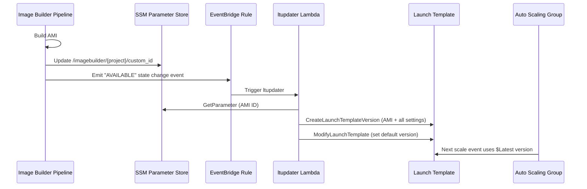
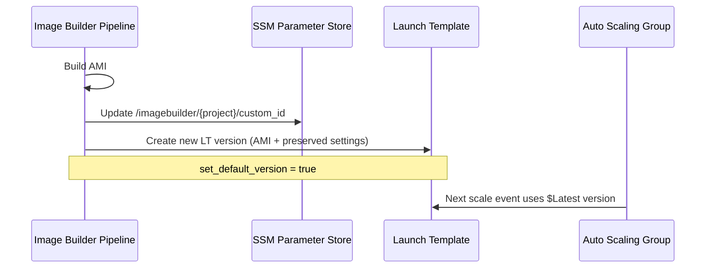
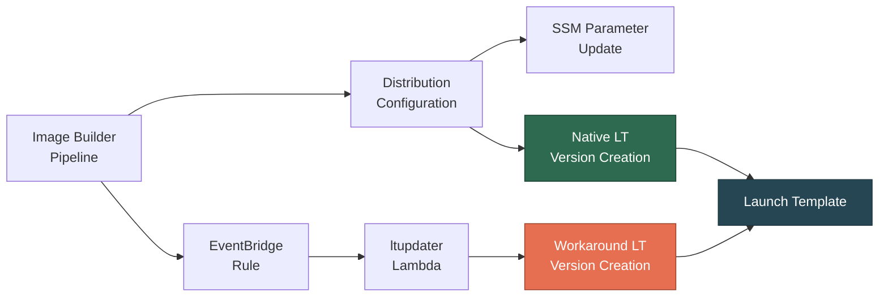

# Design Document: Native LT Distribution Evaluation

## Overview

This design covers the research and evaluation activities needed to determine whether the native `launch_template_configuration` block in EC2 Image Builder now preserves all Launch Template settings when creating new versions — and whether the existing Lambda/EventBridge workaround can be safely retired.

AWS documentation now states that when `launchTemplateConfigurations` are present during distribution, Image Builder "creates a new version of the launch template that includes all of the original settings from the template, and the new AMI ID from the build" ([source](https://docs.aws.amazon.com/imagebuilder/latest/userguide/dist-using-launch-template.html)). This is a change from the historical behavior where Image Builder only carried over the AMI ID and stripped all other settings.

The evaluation follows a structured approach: catalog what exists, add the native block alongside the workaround, trigger a build, inspect the results, and produce a go/no-go decision.

### Key Research Findings

1. **AWS Documentation Confirmation**: The official Image Builder user guide explicitly states that the new LT version "includes all of the original settings from the template, and the new AMI ID from the build." This is the claim we need to verify empirically.

2. **`set_default_version` Support**: The `launch_template_configuration` block supports a `set_default_version` boolean. When `true`, Image Builder marks the newly created LT version as the default — replicating what the Lambda workaround does via `ec2:ModifyLaunchTemplate`.

3. **Terraform Provider Support**: The `aws_imagebuilder_distribution_configuration` resource supports the `launch_template_configuration` nested block with `launch_template_id`, `account_id`, and `set_default_version` attributes.

4. **Current Workaround Mechanics**: The `ltupdater` Lambda explicitly sets `ImageId`, `InstanceType`, `SecurityGroupIds`, and `IamInstanceProfile` when creating a new LT version via `SourceVersion="$Default"`. If the native approach truly preserves all settings, this explicit re-specification becomes redundant.

## Architecture

### Current Architecture (Workaround)



### Proposed Native Architecture (Under Evaluation)



### Side-by-Side Test Architecture

During evaluation, both paths will be active simultaneously. The native block creates a new LT version, and the Lambda also creates one. This produces two new versions per build — which is acceptable for testing purposes.



## Components and Interfaces

### Component 1: Distribution Configuration Change (imagebuilder.tf)

Add a `launch_template_configuration` block to the existing `aws_imagebuilder_distribution_configuration.dist` resource. This is the only Terraform code change required for the test.

```hcl
# Addition to the existing distribution block in imagebuilder.tf
launch_template_configuration {
  launch_template_id = aws_launch_template.custom_lt.id
  account_id         = local.account_id
  set_default_version = true
}
```

This block is added inside the existing `distribution` block, alongside the `ami_distribution_configuration` and `ssm_parameter_configuration` blocks.

### Component 2: Workaround Resource Inventory

Complete catalog of resources that form the workaround, all candidates for removal if the native approach succeeds:

| Resource Type | Resource Name | File | Purpose |
|---|---|---|---|
| `aws_iam_role` | `lambda-ltupdater` | `iam.tf` | IAM execution role for the Lambda |
| `aws_iam_policy` | `ltupdater-lambda_policy` | `iam.tf` | Custom policy for SSM + EC2 LT operations |
| `aws_iam_role_policy_attachment` | `ltupdater-attach` | `iam.tf` | Attaches custom policy to role |
| `aws_iam_role_policy_attachment` | `attach_vpc-ltupdater` | `iam.tf` | Attaches VPC execution policy to role |
| `aws_lambda_function` | `update_launch_template` | `lambda.tf` | The ltupdater Lambda function itself |
| `aws_lambda_permission` | `allow_eventbridge` | `lambda.tf` | Grants EventBridge invoke permission |
| `aws_cloudwatch_event_rule` | `imagebuilder_completed` | `eventbridge.tf` | EventBridge rule matching IB completion |
| `aws_cloudwatch_event_target` | `trigger_lambda` | `eventbridge.tf` | Routes matched events to Lambda |
| `data.archive_file` | `ltupdater` | `data.tf` | ZIP packaging for Lambda deployment |
| (source file) | `ltupdater_lambda_function.py` | `files/` | Lambda function source code |

**Outputs referencing workaround resources:**

| Output Name | File | References |
|---|---|---|
| `ltupdater_lambda_arn` | `outputs.tf` | `aws_lambda_function.update_launch_template.arn` |

**Cross-references (non-workaround → workaround):**

- None identified. The workaround resources are self-contained. They reference non-workaround resources (Launch Template, SSM Parameter, Security Group, VPC subnets) but no non-workaround resource depends on any workaround resource.

**Cross-references (workaround → non-workaround):**

| Workaround Resource | Depends On | File |
|---|---|---|
| `aws_lambda_function.update_launch_template` | `aws_ssm_parameter.custom_built_custom_id` | `lambda.tf` (env var) |
| `aws_lambda_function.update_launch_template` | `aws_launch_template.custom_lt` | `lambda.tf` (env var) |
| `aws_lambda_function.update_launch_template` | `aws_security_group.MyExampleSG` | `lambda.tf` (env var) |
| `aws_lambda_function.update_launch_template` | `aws_iam_instance_profile.scanbox` | `lambda.tf` (env var) |
| `aws_lambda_function.update_launch_template` | `aws_security_group.lambda` | `lambda.tf` (vpc_config) |
| `aws_lambda_function.update_launch_template` | `module.vpc.private_subnets` | `lambda.tf` (vpc_config) |

### Component 3: Verification CLI Commands

AWS CLI commands to trigger a pipeline run and inspect results:

```bash
# 1. Record the current LT version before the test
aws ec2 describe-launch-templates \
  --launch-template-ids <LT_ID> \
  --query 'LaunchTemplates[0].[LatestVersionNumber,DefaultVersionNumber]' \
  --output text

# 2. Capture the current (baseline) LT version details
aws ec2 describe-launch-template-versions \
  --launch-template-id <LT_ID> \
  --versions '$Default' \
  --query 'LaunchTemplateVersions[0].LaunchTemplateData' \
  --output json > baseline_lt_version.json

# 3. Trigger the Image Builder pipeline
aws imagebuilder start-image-pipeline-execution \
  --image-pipeline-arn <PIPELINE_ARN>

# 4. Monitor pipeline status (poll until AVAILABLE or FAILED)
aws imagebuilder list-image-pipeline-images \
  --image-pipeline-arn <PIPELINE_ARN> \
  --query 'imageSummaryList[0].state.status' \
  --output text

# 5. After completion, list the newest LT versions
aws ec2 describe-launch-template-versions \
  --launch-template-id <LT_ID> \
  --versions '$Latest' \
  --query 'LaunchTemplateVersions[0]' \
  --output json > new_lt_version.json

# 6. Compare settings between baseline and new version
# Check: ImageId (should be new AMI), InstanceType, SecurityGroupIds,
#         IamInstanceProfile, BlockDeviceMappings, TagSpecifications
diff <(jq -S 'del(.ImageId)' baseline_lt_version.json) \
     <(jq -S 'del(.ImageId)' new_lt_version.json)

# 7. Verify the new version is set as default
aws ec2 describe-launch-templates \
  --launch-template-ids <LT_ID> \
  --query 'LaunchTemplates[0].DefaultVersionNumber' \
  --output text

# 8. Verify the new AMI ID matches what SSM has
aws ssm get-parameter \
  --name /imagebuilder/<PROJECT>/custom_id \
  --query 'Parameter.Value' \
  --output text
```

### Component 4: Success Criteria Checklist

A build passes the evaluation if and only if ALL of the following are true for the LT version created by the native `launch_template_configuration` block:

| # | Check | How to Verify |
|---|---|---|
| 1 | `ImageId` is the newly built AMI | Compare with SSM parameter value |
| 2 | `InstanceType` matches source version | `jq '.InstanceType'` on both versions |
| 3 | `SecurityGroupIds` match source version | `jq '.NetworkInterfaces[0].Groups // .SecurityGroupIds'` |
| 4 | `IamInstanceProfile` matches source version | `jq '.IamInstanceProfile'` on both versions |
| 5 | `BlockDeviceMappings` match (type, size, encryption) | `jq '.BlockDeviceMappings'` on both versions |
| 6 | `TagSpecifications` match source version | `jq '.TagSpecifications'` on both versions |
| 7 | New version is marked as `$Default` | `describe-launch-templates` DefaultVersionNumber |
| 8 | ASG can reference new version via `$Latest` | `describe-launch-templates` LatestVersionNumber |

If any check fails, the evaluation result is **FAIL** and the workaround remains necessary.

## Data Models

No new data models are introduced. The evaluation works with existing AWS resource structures:

- **Launch Template Version Data** (`LaunchTemplateData`): The JSON structure returned by `describe-launch-template-versions`, containing `ImageId`, `InstanceType`, `SecurityGroupIds`, `IamInstanceProfile`, `BlockDeviceMappings`, and `TagSpecifications`.
- **SSM Parameter**: The existing `/imagebuilder/{project}/custom_id` parameter storing the AMI ID string.
- **Image Builder State Event**: The EventBridge event with `detail.state.status` = `"AVAILABLE"` and `detail.outputResources.amis[].image` containing the new AMI ID.

## Error Handling

### Concurrent Execution Conflicts

When both the native block and the Lambda workaround are active simultaneously:

- **Race condition on `$Default`**: Both paths call `ModifyLaunchTemplate` to set the default version. The last writer wins. Since both set the default to their respective new version, and both versions contain the correct AMI, the end state is valid regardless of ordering. The only difference is which version number ends up as `$Default`.

- **Duplicate LT versions**: Two new versions are created per build instead of one. This is harmless — LT versions are lightweight metadata and don't incur cost. After testing, the extra versions can be cleaned up or ignored.

- **Timing**: The native block executes during the distribution phase (before the EventBridge event fires). The Lambda executes after the EventBridge event. So the native version is created first, then the Lambda version. No true race condition exists — they execute sequentially.

### Terraform Drift Scenarios

| Scenario | Impact | Mitigation |
|---|---|---|
| Image Builder creates new LT versions outside Terraform | `latest_version` and `default_version` attributes drift | Add `lifecycle { ignore_changes = [latest_version, default_version] }` to `aws_launch_template.custom_lt` |
| SSM parameter value changes outside Terraform | Already handled | Existing `lifecycle { ignore_changes = [value] }` on SSM parameter is sufficient |
| Distribution config references LT that Terraform wants to recreate | Potential conflict during `terraform apply` | Use `name_prefix` (already in place) and avoid LT recreation during test |

### Rollback Plan

If the native approach causes issues during testing:

1. Remove the `launch_template_configuration` block from `imagebuilder.tf`
2. Run `terraform apply` to update the distribution configuration
3. The workaround resources remain untouched and continue functioning
4. No data loss or service disruption — the ASG continues using whichever LT version is `$Latest`

## Risk Documentation

### Risk 1: Terraform Drift on Launch Template Attributes

**Risk**: When Image Builder creates new LT versions outside of Terraform, the `latest_version` and `default_version` attributes of `aws_launch_template.custom_lt` will drift. Subsequent `terraform plan` will show changes, and `terraform apply` could potentially revert the default version.

**Severity**: Medium — could cause unexpected plan output and confusion, but unlikely to cause outages.

**Mitigation**: Add a `lifecycle` block to the Launch Template resource:

```hcl
lifecycle {
  ignore_changes = [latest_version, default_version]
}
```

Note: The `aws_launch_template` resource currently has no `lifecycle` block. The existing `lifecycle { ignore_changes = [value] }` is only on the SSM parameter. This is a gap that should be addressed before testing.

**Status**: Requires resolution before testing.

### Risk 2: `$Latest` vs `$Default` Divergence

**Risk**: The ASG currently references `version = "$Latest"`. If `set_default_version = true` is used in the native block, `$Default` and `$Latest` will be the same version. However, if the Lambda workaround also runs and creates an additional version, `$Latest` will point to the Lambda-created version while `$Default` points to the native-created version.

**Severity**: Low — both versions contain the same AMI and settings, so instances launched from either version are functionally identical.

**Mitigation**: Since the ASG uses `$Latest`, it will always pick up the most recently created version. During the test, this will be the Lambda-created version (which runs after the native block). After workaround removal, `$Latest` and `$Default` will converge.

**Status**: Acceptable for testing. No action required.

### Risk 3: Insufficient Lifecycle Blocks

**Risk**: The existing `lifecycle { ignore_changes = [value] }` on the SSM parameter is sufficient for SSM. However, no lifecycle block exists on the Launch Template itself. If Terraform detects that `latest_version` changed (because Image Builder created a new version), it may attempt to update or recreate the Launch Template.

**Severity**: Medium — could cause unintended LT recreation during `terraform apply`.

**Mitigation**: Same as Risk 1 — add `lifecycle { ignore_changes = [latest_version, default_version] }` to the Launch Template resource before testing.

**Status**: Requires resolution before testing.

### Risk 4: AWS Documentation Accuracy

**Risk**: The AWS documentation claims the native block preserves all settings, but this has not been empirically verified in this specific environment. The behavior may vary by region, account type, or specific LT settings used.

**Severity**: Low — the entire purpose of this evaluation is to verify the claim. The test is designed to be non-destructive.

**References**:
- [AWS Image Builder User Guide — Configure AMI distribution with an EC2 launch template](https://docs.aws.amazon.com/imagebuilder/latest/userguide/dist-using-launch-template.html): States the new version "includes all of the original settings from the template, and the new AMI ID from the build."
- [AWS CDK `LaunchTemplateConfiguration` interface](https://docs.aws.amazon.com/cdk/api/v2/docs/@aws-cdk_aws-imagebuilder-alpha.LaunchTemplateConfiguration.html): Documents `setDefaultVersion` parameter.

**Status**: Acceptable — this is the risk the evaluation is designed to address.

### Risk 5: Image Builder IAM Permissions

**Risk**: The native `launch_template_configuration` block requires Image Builder to have `ec2:CreateLaunchTemplateVersion` and `ec2:ModifyLaunchTemplate` permissions. The current `imagebuilder_permissions` IAM policy in `data.tf` includes `ec2:Describe*` and `ec2:CreateTags` but may not include the specific LT modification permissions.

**Severity**: High — if permissions are missing, the native block will fail silently or cause the pipeline to fail.

**Mitigation**: Before testing, verify and update the `imagebuilder_permissions` policy document in `data.tf` to include:
- `ec2:CreateLaunchTemplateVersion`
- `ec2:ModifyLaunchTemplate` (needed for `set_default_version = true`)

**Status**: Requires resolution before testing (blocker).

## Testing Strategy

### Why Property-Based Testing Does Not Apply

This is a research/evaluation spec, not an implementation spec. The acceptance criteria involve:
- Inspecting AWS resource state after an Image Builder pipeline run (manual verification)
- Cataloging existing Terraform resources (static analysis)
- Documenting processes, risks, and success criteria (documentation)

There are no pure functions, parsers, serializers, or business logic to test with property-based testing. The "testing" here is empirical verification of AWS service behavior via CLI commands, not automated code testing.

### Test Approach

**Phase 1: Pre-Test Preparation**
1. Update the `imagebuilder_permissions` IAM policy to include LT modification permissions
2. Add `lifecycle { ignore_changes = [latest_version, default_version] }` to the Launch Template resource
3. Add the `launch_template_configuration` block to the distribution configuration
4. Run `terraform plan` to review changes — should only show distribution config and IAM policy updates
5. Run `terraform apply` to deploy changes

**Phase 2: Execution**
1. Record baseline LT version details using CLI commands from Component 3
2. Trigger a pipeline run via `aws imagebuilder start-image-pipeline-execution`
3. Wait for pipeline completion (15–45 minutes)
4. Inspect the resulting LT versions

**Phase 3: Verification**
1. Walk through the Success Criteria Checklist (Component 4)
2. Compare the native-created LT version against the baseline
3. Compare the Lambda-created LT version against the baseline (as a control)
4. Document results for each check

**Phase 4: Decision**
- If all checks pass → native approach is validated; proceed with workaround removal planning
- If any check fails → document which settings were missing/altered; workaround remains necessary

### Alternative Test Approach (If Concurrent Execution Is Undesirable)

If the operator prefers not to run both paths simultaneously:

1. Disable the EventBridge rule before testing:
   ```bash
   aws events disable-rule --name <PROJECT>-imagebuilder-completed
   ```
2. Add the native `launch_template_configuration` block and apply
3. Trigger a pipeline run and verify results
4. Re-enable the EventBridge rule after testing:
   ```bash
   aws events enable-rule --name <PROJECT>-imagebuilder-completed
   ```

This eliminates the duplicate LT version creation but temporarily disables the workaround. If the native approach fails, the LT will not be updated until the rule is re-enabled.
