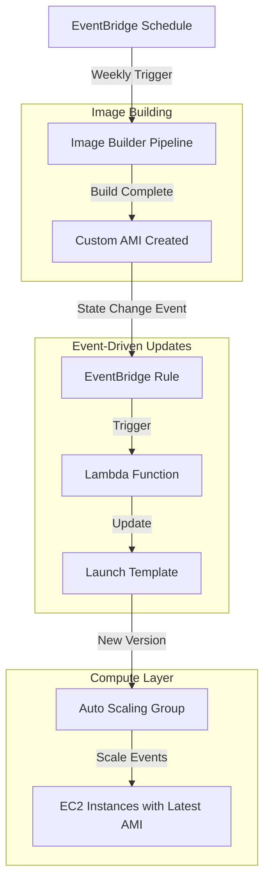
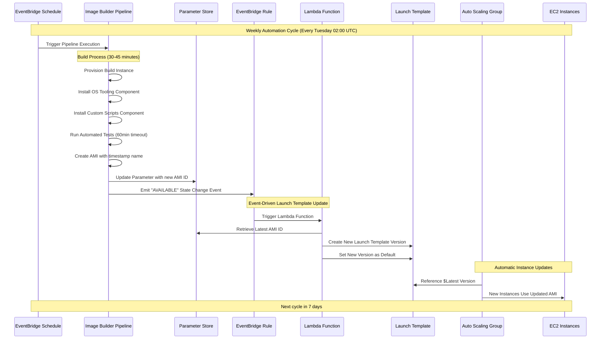

# AWS Autoscaling with EC2 Image Builder

[](https://www.terraform.io/)
[](https://aws.amazon.com/)
[](LICENSE)

> **An educational infrastructure project demonstrating event-driven autoscaling patterns using EC2 Image Builder, Lambda automation, and EventBridge integration.**

This project showcases modern AWS infrastructure automation patterns through a fully automated AMI lifecycle management system. Learn how to build event-driven architectures that eliminate manual operations while maintaining security and cost efficiency.


## Table of Contents

### Getting Started
- [Quick Start Guide](#quick-start-guide) - Deploy in 15 minutes ⚡
- [Learning Objectives](#learning-objectives) - What you'll learn from this project
- [Architecture Overview](#architecture-overview) - High-level system design
- [Prerequisites](#prerequisites) - Required tools and permissions
- [Deployment Instructions](#deployment-instructions) - Step-by-step deployment guide

### Understanding the Architecture
- [AWS Services Used](#aws-services-used) - Detailed service explanations
- [How It Works](#how-it-works) - Complete workflow walkthrough
- [File Structure & Purpose](#file-structure--purpose) - Terraform file documentation
- [Event-Driven Automation Workflow](#event-driven-automation-workflow) - Technical deep dive

### Operation and Maintenance
- [Troubleshooting Guide](#troubleshooting-guide) - Common issues and solutions
- [Best Practices](#best-practices) - Security, cost optimization, and operations
- [Customization Options](#customization-options) - Tailor to your needs

### Resources & References
- [Additional Resources](#additional-resources) - Documentation and learning materials
  - [AWS Documentation](#aws-documentation)
  - [Best Practices Guides](#best-practices-guides)
  - [Terraform Resources](#terraform-resources)
  - [Tools and Utilities](#tools-and-utilities)

---

## Quick Start Guide

**Want to deploy quickly?** Follow these streamlined steps to get up and running in ~15 minutes.

### Prerequisites Checklist
- ✅ AWS Account with Administrator access
- ✅ AWS CLI configured (`aws configure`)
- ✅ Terraform 1.11+ installed
- ✅ Git installed

### Deployment Steps

```bash
# 1. Clone the repository
git clone https://github.com/jmcmillan1873/autoscaling-with-imagebuilder.git
cd autoscaling-with-imagebuilder

# 2. Create configuration file
cp terraform.tfvars.example terraform.tfvars

# 3. Edit terraform.tfvars with your settings (optional - defaults work)
# Minimum required: review region and project name
nano terraform.tfvars  # or use your preferred editor

# 4. Initialize Terraform
terraform init

# 5. Preview changes
terraform plan

# 6. Deploy infrastructure (takes ~5-10 minutes)
terraform apply

# 7. Verify deployment
aws imagebuilder list-image-pipelines --region <your-region>
```

### What Gets Created?
- **VPC** with public and private subnets across 2 AZs
- **Image Builder Pipeline** scheduled for weekly AMI builds
- **Lambda Functions** for automated AMI lifecycle management
- **Auto Scaling Group** (0 instances by default - adjust as needed)
- **EventBridge Rules** for event-driven automation
- **IAM Roles** and **Security Groups** with least-privilege access

### Next Steps After Deployment
1. **Trigger First Build** (optional - or wait for weekly schedule):
   ```bash
   aws imagebuilder start-image-pipeline-execution \
     --image-pipeline-arn <pipeline-arn-from-output> \
     --region <your-region>
   ```

2. **Monitor Build Progress** (~20-30 minutes):
   ```bash
   aws imagebuilder list-image-pipeline-images \
     --image-pipeline-arn <pipeline-arn> \
     --region <your-region>
   ```

3. **Scale Up Instances** (when ready to test):
   ```bash
   aws autoscaling set-desired-capacity \
     --auto-scaling-group-name custom-asg \
     --desired-capacity 1 \
     --region <your-region>
   ```

### Estimated Costs
- **First Month**: ~$5-10 (VPC NAT Gateway + minimal compute)
- **Ongoing**: ~$3-5/month (mostly NAT Gateway at ~$0.045/hour)
- **AMI Storage**: ~$0.05/GB/month (20GB AMI = $1/month)
- **Per Build**: ~$0.01-0.02 (Image Builder compute time)

💡 **Tip**: Set desired_capacity to 0 to minimize costs when not actively using instances.

For detailed explanations and troubleshooting, continue reading below.

---

## Learning Objectives

By exploring and deploying this project, you will learn:

### Infrastructure Automation Concepts
- **Event-Driven Architecture**: Understand how AWS services communicate through EventBridge to create automated workflows
- **Infrastructure as Code**: Gain experience of Terraform patterns for a simple, multi-service AWS deployment
- **Immutable Infrastructure**: Learn the benefits and implementation of treating infrastructure as disposable and reproducible

### AWS Service Integration Patterns
- **EC2 Image Builder**: Automate the creation of hardened, custom AMIs with scheduled builds and testing
- **Auto Scaling Groups**: Implement dynamic scaling with custom launch templates that automatically use the latest AMIs
- **Lambda Automation**: Build serverless functions that respond to AWS events and update infrastructure components
- **EventBridge Integration**: Create event-driven workflows that connect multiple AWS services seamlessly

### Security and Compliance
- **IAM Best Practices**: Implement least-privilege access patterns for cross-service communication
- **Encrypted Storage**: Configure encrypted EBS volumes and secure AMI distribution
- **VPC Security**: Design network isolation with proper subnet segmentation and security groups

### Operational Excellence
- **Automated Updates**: Eliminate manual AMI management through automated pipeline workflows
- **Monitoring and Logging**: Implement CloudWatch integration for pipeline visibility and troubleshooting
- **Scalable Patterns**: Design infrastructure that can grow from development to production environments

## Architecture Overview

This project demonstrates a **modern, event-driven autoscaling pattern** that automatically maintains up-to-date, hardened AMIs in your Auto Scaling Groups. The architecture eliminates manual AMI management while ensuring your instances always run the latest, security-patched images.

### Core Architecture Pattern



### Key Architectural Benefits

1. **Zero-Touch AMI Management**: Once deployed, the system automatically builds, tests, and deploys new AMIs without manual intervention
2. **Event-Driven Automation**: Uses AWS native event systems to create loosely coupled, resilient automation workflows  
3. **Immutable Infrastructure**: Promotes the practice of replacing rather than patching infrastructure components
4. **Scalable Foundation**: Provides a template that can be extended for complex, multi-environment deployments

## AWS Services Used

This architecture leverages multiple AWS services working together to create a fully automated, event-driven infrastructure pattern. Each service plays a specific role in the overall workflow.

### Core Compute Services

#### **[EC2 Image Builder](https://docs.aws.amazon.com/imagebuilder/)**
- **Role**: Automated AMI creation pipeline with built-in testing and validation
- **Key Components**:
  - **Image Recipe**: Defines the base AMI (Amazon Linux 2023) and custom components to install
  - **Infrastructure Configuration**: Specifies build environment (instance type, VPC, security groups)
  - **Distribution Configuration**: Manages AMI distribution across regions and accounts
  - **Pipeline**: Orchestrates the entire build process with scheduling capabilities
- **Automation**: Scheduled weekly builds (Tuesdays at 02:00 UTC) with automatic testing
- **Output**: Hardened, custom AMIs with consistent tooling and security configurations

#### **[Auto Scaling Groups (ASG)](https://docs.aws.amazon.com/autoscaling/)**
- **Role**: Dynamic instance management with automatic scaling based on demand
- **Integration**: Uses launch templates that automatically reference the latest AMI
- **Configuration**: Deployed across multiple AZs for high availability
- **Scaling**: Currently configured for 0-1 instances (can be adjusted for production workloads)

#### **[Launch Templates](https://docs.aws.amazon.com/AWSEC2/latest/UserGuide/ec2-launch-templates.html)**
- **Role**: Versioned instance configuration management
- **Key Features**:
  - References AMI ID from Systems Manager Parameter Store
  - Defines instance type, security groups, and IAM instance profile
  - Configures encrypted EBS volumes (20GB GP3)
  - Supports automatic versioning for seamless updates
- **Automation**: Lambda function creates new versions when AMIs are updated

### Event-Driven Automation Services

#### **[Amazon EventBridge](https://docs.aws.amazon.com/eventbridge/)**
- **Role**: Event-driven service integration and workflow orchestration
- **Key Functions**:
  - **Scheduling**: Triggers Image Builder pipeline on a weekly schedule
  - **Event Routing**: Captures Image Builder state change events and routes them to Lambda
  - **Event Pattern Matching**: Filters for "AVAILABLE" status events from successful builds
- **Integration Pattern**: Decouples services through event-driven communication

#### **[AWS Lambda](https://docs.aws.amazon.com/lambda/)**
- **Role**: Serverless automation for infrastructure updates
- **Function**: `ltupdater` - Updates launch templates when new AMIs are available
- **Key Capabilities**:
  - Retrieves latest AMI ID from Systems Manager Parameter Store
  - Creates new launch template versions with updated AMI
  - Sets new version as default for Auto Scaling Group
  - Runs in VPC for secure access to private resources
- **Runtime**: Python 3.12 with 60-second timeout

#### **[Systems Manager Parameter Store](https://docs.aws.amazon.com/systems-manager/latest/userguide/systems-manager-parameter-store.html)**
- **Role**: Secure storage and retrieval of AMI identifiers
- **Parameter**: `/imagebuilder/{project}/custom_id` stores the latest AMI ID
- **Integration**: 
  - Updated automatically by Image Builder distribution configuration
  - Read by Lambda function for launch template updates
  - Referenced by launch template for AMI selection
- **Data Type**: `aws:ec2:image` for AMI-specific validation

### Security & Networking Infrastructure

#### **[Virtual Private Cloud (VPC)](https://docs.aws.amazon.com/vpc/)**

- **Role**: Isolated network environment for all resources
- **Architecture**: 
  - **CIDR Block**: 11.0.0.0/16 (private address space)
  - **Availability Zones**: Spans 2 AZs for high availability
  - **Public Subnets**: 11.0.1.0/24, 11.0.2.0/24 (for NAT Gateway)
  - **Private Subnets**: 11.0.101.0/24, 11.0.102.0/24 (for compute resources)
- **Connectivity**: Single NAT Gateway for outbound internet access from private subnets
- **Improvement Idea**: The focus of this lab is not on VPC customisation, hence the simple approach to VPC setup here. For better control over VPC customisation, and greater reusability, consider replacing statically defined values with variables.

#### **[Security Groups](https://docs.aws.amazon.com/AWSEC2/latest/UserGuide/ec2-security-groups.html)**
- **Role**: Network-level access control and traffic filtering
- **Configurations**:
  - **Main Security Group**: HTTPS (443) ingress/egress for EC2 instances
  - **Lambda Security Group**: HTTPS (443) egress only for AWS API calls
- **Security Principle**: Minimal required access with explicit allow rules

#### **[Identity and Access Management (IAM)](https://docs.aws.amazon.com/IAM/)**
- **Role**: Least-privilege access control for cross-service communication
- **Key Roles**:
  - **Image Builder Instance Profile**: Permissions for build process and S3 access
  - **Lambda Execution Role**: EC2, SSM, and VPC permissions for launch template updates
  - **EC2 Instance Profile**: Runtime permissions for deployed instances
- **Security Pattern**: Service-specific roles with minimal required permissions

### Supporting Services

#### **[Elastic Block Store (EBS)](https://docs.aws.amazon.com/AWSEC2/latest/UserGuide/AmazonEBS.html)**

- **Role**: Encrypted storage for EC2 instances
- **Configuration**: 20GB GP3 volumes with encryption at rest
- **Integration**: Configured in launch template for consistent storage setup
- **Improvement Idea**: This lab utilises default EBS encryption. In a real world scenario, consider using [AWS Key Management Service - Customer Managed Keys (KMS CMK)](https://docs.aws.amazon.com/kms/latest/developerguide/concepts.html). KMS CMK allows you to control the key policy, who can decrypt/encrypt using that key etc - which allows for better and more fine grained access control to encrypted volumes than the default key, but costs a small amount more. This will become mandatory if you want to share AMI's across Regions or AWS Accounts.

#### **[CloudWatch](https://docs.aws.amazon.com/cloudwatch/)**
- **Role**: Configuring rules for EventBridge
- **Integration**: EventBridge rules use CloudWatch Events for state change detection
- **Observability**: Provides logs and metrics for troubleshooting automation workflows

## How It Works

This section provides a detailed walkthrough of the event-driven automation workflow, explaining how each AWS service contributes to the overall pattern.

### 1. Scheduled AMI Creation Pipeline

#### **Pipeline Initialization**
```hcl
resource "aws_imagebuilder_image_pipeline" "pipeline" {
  name                             = "${var.project}-pipeline"
  status                           = "ENABLED"
  enhanced_image_metadata_enabled  = true

  schedule {
    schedule_expression                = "cron(0 2 ? * TUE *)"
    pipeline_execution_start_condition = "EXPRESSION_MATCH_ONLY"
  }
}
```

- **EventBridge Schedule**: Triggers the Image Builder pipeline weekly (Tuesdays at 02:00 UTC)
- **Schedule Expression**: `cron(0 2 ? * TUE *)` ensures consistent, predictable builds
- **Pipeline Status**: Enabled with enhanced metadata collection for detailed tracking
- **Execution Condition**: `EXPRESSION_MATCH_ONLY` prevents manual triggers from interfering with scheduled builds

#### **Image Building Process**
1. **Infrastructure Provisioning**: Image Builder launches a temporary EC2 instance in the private subnet
2. **Base Image Selection**: Starts with the latest Amazon Linux 2023 AMI from AWS
3. **Component Installation**: Applies custom components in sequence:
   - **OS Tooling Component**: Installs essential system tools and security hardening
   - **Custom Scripts Component**: Downloads and configures project-specific tooling
4. **Image Testing**: Built-in tests validate the AMI functionality (60-minute timeout)
5. **AMI Creation**: Successful builds create a new AMI with standardized naming: `{project}-{buildDate}`

#### **Distribution and Storage**
- **AMI Distribution**: New AMI is distributed with consistent tags (OS, Hardened, Name)
- **Parameter Store Update**: AMI ID is automatically stored in `/imagebuilder/{project}/custom_id`
- **Cleanup**: Temporary build instance is terminated after successful completion

### 2. Event-Driven Launch Template Updates

#### **Event Detection and Routing**
```json
{
  "source": ["aws.imagebuilder"],
  "detail-type": ["EC2 Image Builder Image State Change"],
  "detail": {
    "state": {
      "status": ["AVAILABLE"]
    }
  }
}
```

- **EventBridge Rule**: Monitors for Image Builder state change events
- **Event Filtering**: Only processes events with "AVAILABLE" status (successful builds)
- **Lambda Trigger**: Matching events automatically invoke the `ltupdater` Lambda function

#### **Automated Launch Template Updates**
The Lambda function performs the following operations:

1. **AMI ID Retrieval**: Reads the latest AMI ID from Systems Manager Parameter Store
2. **Launch Template Versioning**: Creates a new launch template version with:
   - Updated AMI ID from the latest build
   - Consistent instance configuration (type, security groups, IAM profile)
   - Encrypted EBS volume configuration (20GB GP3)
3. **Default Version Update**: Sets the new version as the default for the Auto Scaling Group
4. **Error Handling**: Includes comprehensive error handling and logging for troubleshooting

#### **Lambda Function Environment**
- **Runtime**: Python 3.12 with optimized performance
- **VPC Integration**: Runs within private subnets for secure AWS API access
- **Environment Variables**: Configurable parameters for launch template ID, instance type, and security groups
- **Timeout**: 60-second execution limit for reliable completion

### 3. Automatic Instance Lifecycle Management

#### **Auto Scaling Group Integration**
```hcl
launch_template {
  id      = aws_launch_template.custom_lt.id
  version = "$Latest"
}
```

- **Dynamic Version Reference**: ASG configured with `$Latest` ensures automatic adoption of new launch template versions
- **Zero-Configuration Updates**: No ASG modification required when Lambda updates launch template default version
- **Immediate Effect**: New scaling events automatically use the updated AMI without manual intervention
- **Multi-AZ Deployment**: Instances launched across private subnets in multiple availability zones for resilience
- **Consistent Configuration**: All instances maintain identical security groups, IAM profiles, and EBS encryption settings

#### **Instance Refresh Capabilities**
- **Manual Refresh**: Existing instances can be refreshed using ASG instance refresh features
- **Rolling Updates**: Supports gradual replacement of existing instances with new AMI
- **Zero-Downtime**: Maintains service availability during instance updates (when properly configured)

#### **Scaling Behavior**
- **Current Configuration**: 0-1 instances (suitable for development/testing)
- **Production Scaling**: Can be adjusted for higher capacity and automatic scaling policies
- **Health Checks**: EC2 health checks ensure only healthy instances remain in service

### 4. Security and Network Isolation

#### **Network Architecture**
- **VPC Isolation**: All resources operate within a dedicated VPC (11.0.0.0/16)
- **Subnet Strategy**: 
  - **Private Subnets**: Host compute resources (Image Builder, Lambda, EC2 instances)
  - **Public Subnets**: Contain NAT Gateway for controlled outbound internet access
- **Internet Connectivity**: Single NAT Gateway provides cost-effective outbound access

#### **Security Controls**
- **Security Groups**: Implement network-level access control
  - **Instance Security Group**: HTTPS (443) for AWS API communication
  - **Lambda Security Group**: Outbound HTTPS only for service calls
- **IAM Roles**: Enforce least-privilege access patterns
  - **Service-Specific Permissions**: Each service has only required permissions
  - **Cross-Service Access**: Secure communication between Lambda, SSM, and EC2 services

#### **Data Protection**
- **Encryption at Rest**: All EBS volumes use AWS-managed encryption
- **Secure Parameter Storage**: AMI IDs stored securely in Systems Manager Parameter Store
- **Network Encryption**: All AWS API calls use TLS encryption in transit

### 5. Event-Driven Architecture Benefits

#### **Loose Coupling**
- **Service Independence**: Each service operates independently with event-based communication
- **Failure Isolation**: Issues in one component don't cascade to others
- **Scalability**: Individual services can be scaled based on specific requirements

#### **Automation Reliability**
- **Consistent Execution**: Scheduled builds ensure regular AMI updates
- **Automatic Recovery**: Failed builds don't affect existing infrastructure
- **Audit Trail**: EventBridge and CloudWatch provide complete workflow visibility

#### **Operational Excellence**
- **Zero-Touch Operations**: No manual intervention required for AMI lifecycle management
- **Predictable Updates**: Scheduled builds provide consistent, testable update cycles
- **Infrastructure as Code**: Complete automation enables version control and reproducible deployments

This comprehensive automation pattern eliminates manual AMI management while ensuring your infrastructure remains current with security patches and organizational standards.

## Prerequisites

Before deploying this infrastructure, ensure you have the following tools and permissions configured:

### Required Tools and Versions

#### **Terraform**
- **Version**: >= 1.11.0 (as specified in `main.tf`)
- **Installation**: Download from [terraform.io](https://www.terraform.io/downloads.html)
- **Verification**: Run `terraform version` to confirm installation

#### **AWS CLI**
- **Version**: >= 2.0 (recommended for latest features)
- **Installation**: Follow [AWS CLI installation guide](https://docs.aws.amazon.com/cli/latest/userguide/getting-started-install.html)
- **Configuration**: Run `aws configure` to set up credentials and default region

#### **Git** (Optional but Recommended)
- **Purpose**: Version control and project cloning
- **Installation**: Download from [git-scm.com](https://git-scm.com/downloads)

### AWS Account Requirements

#### **AWS Account Access**
- **Administrative Privileges**: Required for creating IAM roles, VPC resources, and AWS services
- **Account Limits**: Ensure sufficient service limits for:
  - VPC (1 additional VPC)
  - EC2 instances (for Image Builder and Auto Scaling)
  - Lambda functions (1 function)
  - EventBridge rules (2 rules)

#### **AWS Credentials Configuration**
Choose one of the following authentication methods:

**Option 1: AWS CLI Profiles**
```bash
aws configure --profile your-profile-name
# Enter: Access Key ID, Secret Access Key, Default region, Output format
```

**Option 2: Environment Variables**
```bash
export AWS_ACCESS_KEY_ID="your-access-key"
export AWS_SECRET_ACCESS_KEY="your-secret-key"
export AWS_DEFAULT_REGION="eu-west-1"
```

**Option 3: IAM Roles (for EC2/Lambda execution)**
- Attach appropriate IAM role to your execution environment
- Ensure role has necessary permissions listed below

#### **Required AWS Permissions**
Your AWS credentials must have permissions for the following services:
- **EC2**: Full access for instances, launch templates, Auto Scaling Groups
- **VPC**: Full access for VPC, subnets, security groups, NAT Gateway
- **IAM**: Create and manage roles, policies, and instance profiles
- **Image Builder**: Full access for pipelines, recipes, components
- **Lambda**: Create and manage functions, permissions
- **EventBridge**: Create and manage rules, targets
- **Systems Manager**: Parameter Store read/write access
- **CloudWatch**: Logs and events access

**Minimum IAM Policy Example:**
```json
{
  "Version": "2012-10-17",
  "Statement": [
    {
      "Effect": "Allow",
      "Action": [
        "ec2:*",
        "iam:*",
        "imagebuilder:*",
        "lambda:*",
        "events:*",
        "ssm:*",
        "logs:*"
      ],
      "Resource": "*"
    }
  ]
}
```

### Regional Considerations

#### **Supported Regions**
- **Default Region**: eu-west-1 (Ireland)
- **Alternative Regions**: Any AWS region supporting all required services
- **Service Availability**: Verify that EC2 Image Builder is available in your chosen region

#### **Graviton Instance Support**
- **Instance Types**: t4g family (ARM64 architecture)
- **Regional Availability**: Ensure Graviton instances are available in your deployment region
- **Alternative**: Modify `build_instance_types` variable for x86 instances if needed

### Network Requirements

#### **Internet Connectivity**
- **Outbound HTTPS**: Required for downloading packages and AWS API calls
- **NAT Gateway**: Automatically provisioned for private subnet internet access
- **No Inbound Access**: Architecture doesn't require inbound internet connectivity

#### **IP Address Planning**
- **VPC CIDR**: 11.0.0.0/16 (default, configurable)
- **Subnet Allocation**: 
  - Public: 11.0.1.0/24, 11.0.2.0/24
  - Private: 11.0.101.0/24, 11.0.102.0/24
- **Conflict Check**: Ensure CIDR doesn't conflict with existing VPCs

### Cost Considerations

#### **Estimated Monthly Costs** (eu-west-1 region)
- **VPC Components**: ~$45/month (NAT Gateway primary cost)
- **EC2 Instances**: Variable based on Auto Scaling Group usage
- **Image Builder**: ~$2-5/month (weekly builds, t4g.small instances)
- **Lambda**: <$1/month (minimal execution time)
- **Other Services**: <$5/month (EventBridge, Parameter Store, CloudWatch)

**Total Estimated Cost**: $50-60/month for development/testing workloads (or $1-2/day whilst testing)

#### **Cost Optimization Tips**
- **Clean up**: Most importantly - Delete the resources for the lab when you've finished to stop costs accumulating. 
- **Instance Types**: t4g.small provides good balance of cost and performance
- **Build Frequency**: Weekly builds balance security with cost
- **Auto Scaling**: Set appropriate min/max values for your workload

## Deployment Instructions

Follow these step-by-step instructions to deploy the autoscaling with Image Builder infrastructure:

### Step 1: Project Setup

#### **Clone or Download Project**
```bash
# Clone from repository (if available)
git clone https://github.com/jmcmillan1873/autoscaling-with-imagebuilder.git
cd autoscaling-with-imagebuilder
```

#### **Verify Project Structure**
Confirm you have all required files:
```bash
ls -la *.tf
# Expected files:
# main.tf, variables.tf, data.tf, locals.tf
# vpc.tf, security-group.tf, iam.tf
# imagebuilder.tf, lambda.tf, eventbridge.tf
# ec2-asg.tf, ssm.tf
```

### Step 2: Configure Variables

#### **Create terraform.tfvars File**
Create a `terraform.tfvars` file to customize your deployment:

```hcl
# terraform.tfvars
region           = "eu-west-1"             # Change to your preferred region
project          = "MyAutoscalingProject"  # Customize project name
instance_type    = "t4g.small"             # Adjust instance size as needed
ami_retain_count = 5                       # Number of AMIs to keep when housekeeping. 

# Customize default tags
default_tags = {
  Owner       = "YourName"
  Project     = "MyAutoscalingProject"
  Environment = "Development"  # or "Production", "Staging"
}

# Optional: Customize build instance types
build_instance_types = ["t4g.small", "t4g.medium"]
```

#### **Variable Configuration Options**

**Region Selection:**
- Select the region you'd like to deploy to. 
- Defaults to `eu-west-1`

**Project Naming:**
- Use alphanumeric characters and hyphens only
- Keep under 20 characters for resource name limits
- Choose descriptive names for easy identification

**Instance Type Selection:**
- The lab uses the Graviton t4g family. Feel free to change this, but make correct the code to accommodate (hint - look for `arm64` and change that to your preferred architecture type)

**Retain AMIs / Housekeeping**
- The `amicleaner` Lambda function deletes old AMIs and Snapshots, it will preserve as many images as is configured by `ami_retain_count`.

### Step 3: Initialize Terraform

#### **Initialize Terraform Backend**
```bash
terraform init
```

**Expected Output:**
```
Initializing the backend...
Initializing provider plugins...
- Finding hashicorp/aws versions matching "6.13.0"...
- Installing hashicorp/aws v6.13.0...
Terraform has been successfully initialized!
```

#### **Validate Configuration**
```bash
terraform validate
```

**Expected Output:**
```
Success! The configuration is valid.
```

### Step 4: Plan Deployment

#### **Review Deployment Plan**
```bash
terraform plan
```

### Step 5: Deploy Infrastructure

#### **Apply Terraform Configuration**
```bash
terraform apply
```

**Deployment Process:**
1. **Review Plan**: Terraform shows resources to be created
2. **Confirm Deployment**: Type `yes` when prompted
3. **Monitor Progress**: Watch resource creation (typically 5-10 minutes)
4. **Completion**: Note the outputs displayed at the end

**Expected Deployment Time:** 8-12 minutes

#### **Monitor Deployment Progress**
During deployment, you can monitor progress in the AWS Console:
- **VPC Console**: Watch VPC and subnet creation
- **EC2 Console**: Monitor security groups and launch template
- **Image Builder Console**: Verify pipeline creation
- **Lambda Console**: Confirm function deployment

### Step 6: Verify Deployment

#### **Check Terraform Outputs**
```bash
terraform output
```

**Expected Outputs:**
- VPC ID and subnet information
- Security group IDs
- Launch template ID
- Auto Scaling Group name
- Image Builder pipeline ARN

#### **Verify AWS Resources**

**1. VPC and Networking:**
```bash
# Check VPC creation
aws ec2 describe-vpcs --filters "Name=tag:Project,Values=YourProjectName"

# Verify subnets
aws ec2 describe-subnets --filters "Name=tag:Project,Values=YourProjectName"
```

**2. Image Builder Pipeline:**
```bash
# Check pipeline status
aws imagebuilder describe-image-pipelines --image-pipeline-arns $(terraform output -raw imagebuilder_pipeline_arn)
```

**3. Auto Scaling Group:**
```bash
# Verify ASG creation
aws autoscaling describe-auto-scaling-groups --auto-scaling-group-names $(terraform output -raw asg_name)
```

**4. Lambda Function:**
```bash
# Check Lambda function
aws lambda get-function --function-name $(terraform output -raw lambda_function_name)
```

#### **Test Initial Functionality**

**1. Trigger Manual Image Build (Optional):**
```bash
# Start a manual pipeline execution
aws imagebuilder start-image-pipeline-execution --image-pipeline-arn $(terraform output -raw imagebuilder_pipeline_arn)
```

**2. Check Parameter Store:**
```bash
# Verify AMI parameter exists
aws ssm get-parameter --name "/imagebuilder/$(terraform output -raw project_name)/custom_id"
```

**3. Monitor CloudWatch Logs:**
```bash
# Check Lambda function logs (after first execution)
aws logs describe-log-groups --log-group-name-prefix "/aws/lambda/"
```

### Step 7: Post-Deployment Configuration

#### **Schedule Verification**
- **Image Builder Pipeline**: Automatically runs Tuesdays at 02:00 UTC
- **First Build**: May take 15-20 minutes to complete
- **EventBridge Rules**: Verify in AWS Console under EventBridge

#### **Security Review**
- **IAM Roles**: Review created roles and policies
- **Security Groups**: Verify network access rules
- **Encryption**: Confirm EBS volumes are encrypted

## Troubleshooting Guide

This comprehensive guide covers common issues, their causes, and step-by-step solutions.

### AWS Permissions and IAM Issues

#### Issue: Access Denied Errors During Terraform Apply

**Symptoms:**
```
Error: creating EC2 Image Builder Pipeline: AccessDeniedException
Error: creating Lambda Function: AccessDenied
```

**Causes:**
- Insufficient IAM permissions for the user/role running Terraform
- Missing service-specific permissions
- SCP (Service Control Policy) restrictions in AWS Organizations

**Solutions:**

1. **Verify your identity and permissions:**
```bash
# Check who you are
aws sts get-caller-identity

# List attached policies
aws iam list-attached-user-policies --user-name <your-username>
```

2. **Required permissions** - Your IAM user/role needs:
   - `ec2:*` - For VPC, Security Groups, Launch Templates
   - `imagebuilder:*` - For Image Builder pipelines
   - `lambda:*` - For Lambda functions
   - `iam:*` - For creating roles and policies
   - `events:*` - For EventBridge rules
   - `ssm:*` - For Parameter Store
   - `logs:*` - For CloudWatch Logs

3. **Quick fix** - Attach AWS managed policy (development only):
```bash
aws iam attach-user-policy \
  --user-name <your-username> \
  --policy-arn arn:aws:iam::aws:policy/AdministratorAccess
```

4. **Production fix** - Create least-privilege custom policy (see documentation)

#### Issue: "Quota Exceeded" Errors

**Symptoms:**
```
Error: VpcLimitExceeded: The maximum number of VPCs has been reached
Error: InstanceLimitExceeded: You have requested more instances than your current instance limit
```

**Causes:**
- AWS account has soft limits (quotas) on resources
- New accounts have lower default limits
- Existing resources consuming available quota

**Solutions:**

1. **Check current limits:**
```bash
# VPC limits
aws ec2 describe-account-attributes --attribute-names max-instances

# Service Quotas (general)
aws service-quotas list-service-quotas \
  --service-code ec2 \
  --query 'Quotas[?QuotaName==`Running On-Demand Standard (A, C, D, H, I, M, R, T, Z) instances`]'
```

2. **Request quota increase:**
   - AWS Console → Service Quotas → AWS services → Select service
   - Click "Request quota increase"
   - Typical approval: 1-2 business days

3. **Clean up unused resources:**
```bash
# List VPCs
aws ec2 describe-vpcs --query 'Vpcs[*].[VpcId,Tags[?Key==`Name`].Value|[0]]'

# Delete unused VPC (be careful!)
aws ec2 delete-vpc --vpc-id vpc-xxxxx
```

### Image Builder Issues

#### Issue: Image Builder Pipeline Fails to Start

**Symptoms:**
- Pipeline shows "FAILED" status
- Build never begins
- CloudWatch logs show permission errors

**Causes:**
- IAM role missing permissions
- Security group blocking HTTPS
- Subnet has no internet access
- Component syntax errors

**Solutions:**

1. **Check pipeline status:**
```bash
aws imagebuilder list-image-pipeline-images \
  --image-pipeline-arn <pipeline-arn> \
  --region <region>
```

2. **Review CloudWatch Logs:**
```bash
# Find log group
aws logs describe-log-groups \
  --log-group-name-prefix /aws/imagebuilder

# View recent logs
aws logs tail /aws/imagebuilder/<pipeline-name> --follow
```

3. **Verify IAM role:**
```bash
# Check if role exists
aws iam get-role --role-name <project>-imagebuilder-role

# Verify instance profile
aws iam get-instance-profile --instance-profile-name <project>-Imagebuilder
```

4. **Test network connectivity** - Ensure private subnet has NAT Gateway route

5. **Validate component syntax** - Check YAML files in `files/` directory

#### Issue: AMI Build Succeeds but Parameter Not Updated

**Symptoms:**
- Image Builder shows "AVAILABLE"
- SSM Parameter still has old AMI ID
- Lambda function not triggered

**Causes:**
- Distribution configuration not linked to Parameter Store
- EventBridge rule not working
- Lambda function errors

**Solutions:**

1. **Verify Parameter Store configuration:**
```bash
# Check parameter value
aws ssm get-parameter \
  --name /imagebuilder/<project>/custom_id \
  --region <region>

# Check parameter history
aws ssm get-parameter-history \
  --name /imagebuilder/<project>/custom_id \
  --region <region>
```

2. **Check EventBridge rule:**
```bash
# List rules
aws events list-rules --name-prefix <project>

# Check rule targets
aws events list-targets-by-rule --rule <project>-imagebuilder-completed
```

3. **Review Lambda logs:**
```bash
aws logs tail /aws/lambda/ltupdater --follow --region <region>
```

4. **Manually trigger Lambda** (testing):
```bash
aws lambda invoke \
  --function-name ltupdater \
  --region <region> \
  response.json
```

### Networking Issues

#### Issue: NAT Gateway Connectivity Problems

**Symptoms:**
- Image Builder builds fail with timeout
- Instances can't download packages
- Lambda functions timeout

**Causes:**
- NAT Gateway not created
- Route table not configured
- Network ACLs blocking traffic

**Solutions:**

1. **Verify NAT Gateway exists:**
```bash
aws ec2 describe-nat-gateways \
  --filter "Name=tag:Name,Values=*<project>*" \
  --region <region>
```

2. **Check route tables:**
```bash
# List private subnet route tables
aws ec2 describe-route-tables \
  --filters "Name=tag:Name,Values=*private*" \
  --region <region>

# Verify route to NAT Gateway
# Should see: 0.0.0.0/0 → nat-xxxxx
```

3. **Test outbound connectivity** - Launch test instance in private subnet:
```bash
# Via Session Manager (no SSH needed)
aws ssm start-session --target <instance-id>

# Inside instance
curl -I https://aws.amazon.com
ping 8.8.8.8  # Should fail (no ICMP in security group)
```

#### Issue: Security Group Blocking Traffic

**Symptoms:**
- API calls failing
- Package downloads failing
- Health checks failing

**Solutions:**

1. **Review security group rules:**
```bash
aws ec2 describe-security-groups \
  --group-ids <sg-id> \
  --region <region>
```

2. **Verify HTTPS egress is allowed** (port 443 to 0.0.0.0/0)

3. **Check VPC Flow Logs** (if enabled):
```bash
aws ec2 describe-flow-logs --region <region>
```

### Lambda Function Issues

#### Issue: Lambda Function Timeouts

**Symptoms:**
- Function runs for 60 seconds then times out
- CloudWatch shows incomplete execution
- Launch Template not updated

**Causes:**
- Network connectivity issues
- API rate limiting
- Insufficient memory

**Solutions:**

1. **Check Lambda logs:**
```bash
aws logs tail /aws/lambda/ltupdater --since 1h --region <region>
```

2. **Increase timeout** (if needed):
```bash
aws lambda update-function-configuration \
  --function-name ltupdater \
  --timeout 120 \
  --region <region>
```

3. **Verify VPC configuration** - Ensure Lambda in correct subnets with NAT access

#### Issue: AMI Cleaner Not Deleting AMIs

**Symptoms:**
- Old AMIs accumulating
- Lambda runs successfully but nothing deleted
- CloudWatch logs show "DRY_RUN mode"

**Cause:**
- DRY_RUN environment variable set to "true" (default safety feature)

**Solution:**

1. **Verify current setting:**
```bash
aws lambda get-function-configuration \
  --function-name <project>-ami-retention \
  --query 'Environment.Variables.DRY_RUN'
```

2. **Disable DRY_RUN** (after testing):
   - Edit `lambda.tf`
   - Change `DRY_RUN = "true"` to `DRY_RUN = "false"`
   - Run `terraform apply`

3. **Monitor first real run:**
```bash
aws logs tail /aws/lambda/<project>-ami-retention --follow
```

### Terraform Issues

#### Issue: Terraform State Lock

**Symptoms:**
```
Error: Error locking state: Error acquiring the state lock
```

**Causes:**
- Previous `terraform apply` interrupted
- Concurrent Terraform runs
- Crashed Terraform process

**Solutions:**

1. **Verify no other Terraform processes running:**
```bash
ps aux | grep terraform
```

2. **Force unlock** (use with caution):
```bash
terraform force-unlock <lock-id>
```

3. **If using S3 backend**, check DynamoDB lock table

#### Issue: Terraform Plan Shows Changes Every Time

**Symptoms:**
- `terraform plan` always shows changes
- Resources appear to need modification
- No actual changes made

**Common culprits:**
- SSM Parameter value (ignore_changes configured)
- Launch Template latest_version (expected)
- Random provider values

**Solution:**
- Review specific resources showing changes
- Check lifecycle blocks and ignore_changes
- Ensure consistent Terraform version across team

### Cost-Related Issues

#### Issue: Unexpected High Costs

**Common causes and solutions:**

1. **NAT Gateway** (~$33/month + data transfer):
   - Expected - required for private subnet internet access
   - Reduction: Use VPC Endpoints for AWS services

2. **Running EC2 instances**:
   - Check Auto Scaling Group desired capacity
   - Scale down to 0 when not in use:
   ```bash
   aws autoscaling set-desired-capacity \
     --auto-scaling-group-name custom-asg \
     --desired-capacity 0
   ```

3. **EBS Snapshots from AMIs**:
   - Check retention settings
   - Enable amicleaner Lambda (disable DRY_RUN)
   - Manual cleanup:
   ```bash
   aws ec2 describe-snapshots --owner-ids self \
     --filters "Name=tag:ManagedBy,Values=AWSImageBuilder"
   ```

4. **Lambda in VPC** (ENI charges):
   - Minimal cost (~$0.01/ENI/hour)
   - Expected for VPC-connected Lambda

**Monitor costs:**
```bash
# Enable AWS Cost Explorer in console
# Set up billing alerts
# Tag resources consistently for cost allocation
```

### Getting Additional Help

If you've tried the above solutions and still face issues:

1. **Check AWS Service Health Dashboard**: https://status.aws.amazon.com/
2. **Review Terraform logs**: `TF_LOG=DEBUG terraform apply`
3. **AWS Support**: Create a support case (if you have a support plan)
4. **Community**: AWS forums, Stack Overflow, GitHub issues
5. **Documentation**: AWS service-specific troubleshooting guides

### Next Steps After Deployment

#### **Immediate Actions**
1. **Monitor First Build**: Watch the first Image Builder execution
2. **Review Costs**: Check AWS billing dashboard after 24 hours
3. **Test Scaling**: Manually adjust ASG capacity to test scaling

#### **Customization Opportunities**
1. **Modify Components**: Update Image Builder components for your needs
2. **Adjust Scaling**: Configure Auto Scaling policies for your workload
3. **Add Monitoring**: Implement additional CloudWatch metrics and alarms
4. **Upgrade Encryption**: Replace default EBS encryption with KMS CMK. 
5. **Add LifeCycle Policy**: Add a Lifecycle policy to EC2 Image Builder to delete older AMIs. e.g. *Retain the last 5 AMIs.* 

#### **Production Considerations**
1. **Backup Strategy**: Implement AMI and configuration backups
2. **Multi-Region**: Extend to multiple regions for disaster recovery (requires KMS CMK)
3. **Security Hardening**: Add additional security controls and monitoring

This comprehensive deployment guide ensures successful infrastructure deployment while providing troubleshooting guidance and next steps for customization.

## File Structure & Purpose

This section provides detailed documentation of each Terraform file, explaining their purpose, key resources, and relationships within the overall architecture.

### Core Configuration Files

#### **`main.tf`** - Provider and Terraform Configuration
**Purpose**: Defines Terraform and AWS provider requirements with default tagging strategy

**Key Resources**:
- **Terraform Block**: Specifies minimum Terraform version (>=1.11.0) and AWS provider version (6.0+)
- **AWS Provider**: Configures regional deployment with automatic default tagging
- **Default Tags**: Demonstrates applying consistent tags (Owner, Project, Environment) to all resources

**Configuration Notes**:
- Uses variable-driven region configuration for multi-region flexibility
- Implements organization-wide tagging standards through `var.default_tags`
- Provider version pinning ensures consistent deployments across environments

**Dependencies**: None (foundational configuration file)

---

#### **`variables.tf`** - Input Variable Definitions
**Purpose**: Centralizes all configurable parameters for the infrastructure deployment

**Key Variables**:
- **`region`**: AWS deployment region (default: eu-west-1)
- **`project`**: Project identifier used in resource naming and tagging
- **`instance_type`**: EC2 instance type for Auto Scaling Group (default: t4g.small)
- **`build_instance_types`**: Array of instance types for Image Builder (Graviton-based)
- **`default_tags`**: Standard tags applied to all resources
- **`ami_retain_count`**: The number of ImageBuilder produced AMI's to retain (Look at the `amicleaner` Lambda function to see selection criteria.)

**Configuration Notes**:
- Graviton-based instance types (t4g family) for cost optimization and performance
- Flexible build instance types support different workload requirements
- Consistent naming convention using project variable across all resources

**Dependencies**: Referenced by all other Terraform files for configuration values

---

#### **`locals.tf`** - Computed Local Values
**Purpose**: Defines dynamic values computed at runtime for use across the configuration

**Key Locals**:
- **`account_id`**: Current AWS account ID retrieved from caller identity
- **Dynamic References**: Enables account-specific resource ARN construction

**Configuration Notes**:
- Eliminates hardcoded account IDs for better portability
- Supports multi-account deployments with dynamic account resolution
- Used in IAM policies and resource ARNs requiring account-specific references

**Dependencies**: Uses `data.aws_caller_identity.current` from `data.tf`

---

#### **`data.tf`** - Data Sources and Policy Documents
**Purpose**: Retrieves external data and defines IAM policy documents for secure service communication

**Key Data Sources**:
- **`aws_caller_identity.current`**: Current AWS account information
- **`aws_ssm_parameter.al2023`**: Latest Amazon Linux 2023 ARM64 AMI ID
- **`aws_ami.al2023`**: AMI details for initial launch template configuration
- **`archive_file.ltupdater`**: Lambda deployment package creation

**IAM Policy Documents**:
- **`assume_lambda`**: Lambda service trust policy for function execution
- **`lambda_ltupdater_policy`**: Permissions for launch template updates and SSM access
- **`assume_ec2`**: EC2 and Image Builder service trust policy
- **`imagebuilder_permissions`**: Comprehensive Image Builder build permissions

**Configuration Notes**:
- Uses AWS-managed parameter for latest AMI discovery (`/aws/service/ami-amazon-linux-latest/`)
- Implements least-privilege IAM policies with specific resource access
- Supports ARM64 architecture alignment with Graviton instance types

**Dependencies**: None (provides foundational data for other resources)

---

### Networking Infrastructure

#### **`vpc.tf`** - Virtual Private Cloud Configuration
**Purpose**: Creates isolated network environment with public/private subnet architecture

**Key Resources**:
- **VPC Module**: Uses terraform-aws-modules/vpc for standardized VPC creation
- **Network Architecture**: 
  - CIDR: 11.0.0.0/16 (65,536 IP addresses)
  - Public Subnets: 11.0.1.0/24, 11.0.2.0/24 (for NAT Gateway)
  - Private Subnets: 11.0.101.0/24, 11.0.102.0/24 (for compute resources)
- **Connectivity**: Single NAT Gateway for cost-effective outbound internet access

**Configuration Notes**:
- Multi-AZ deployment across two availability zones for high availability
- Private subnets host all compute resources (EC2, Lambda, Image Builder)
- DNS resolution enabled for internal service discovery
- Single NAT Gateway reduces costs while maintaining outbound connectivity

**Dependencies**: Uses `var.region` and `var.default_tags` from variables

**Relationships**: Provides subnet IDs for security groups, Lambda, ASG, and Image Builder

---

#### **`security-group.tf`** - Network Access Control
**Purpose**: Implements network-level security controls with minimal required access

**Key Resources**:
- **`aws_security_group.MyExampleSG`**: Main security group for EC2 instances and Image Builder
  - **Ingress**: HTTPS (443) from anywhere (for AWS API access)
  - **Egress**: HTTPS (443) to anywhere (for software downloads and AWS APIs)
- **`aws_security_group.lambda`**: Lambda-specific security group
  - **Egress Only**: HTTPS (443) for AWS service communication

**Configuration Notes**:
- Follows principle of least privilege with minimal port exposure
- HTTPS-only communication ensures encrypted data in transit
- Separate security groups for different service types enable granular control
- No SSH access enforces immutable infrastructure practices

**Dependencies**: Requires VPC ID from `vpc.tf`

**Relationships**: Referenced by EC2 instances, Lambda functions, and Image Builder infrastructure

---

### Identity and Access Management

#### **`iam.tf`** - IAM Roles and Policies
**Purpose**: Implements least-privilege access control for cross-service communication

**Key Resources**:
- **`aws_iam_role.scanbox`**: EC2 instance role for deployed instances
- **`aws_iam_instance_profile.scanbox`**: Instance profile for EC2 role attachment
- **`aws_iam_role.imagebuilder_role`**: Image Builder service role with build permissions
- **`aws_iam_instance_profile.imagebuilder`**: Instance profile for Image Builder instances

**Policy Attachments**:
- **SSM Core Policy**: Enables Systems Manager agent functionality
- **Image Builder Permissions**: Custom policy for AMI creation and management
- **Lifecycle Execution Policy**: AWS-managed policy for Image Builder operations

**Configuration Notes**:
- Separate roles for different service functions (runtime vs. build)
- Instance profiles enable EC2 instances to assume IAM roles
- Follows AWS security best practices with service-specific permissions

**Dependencies**: Uses trust policies from `data.tf`

**Relationships**: Instance profiles referenced by launch templates and Image Builder configuration

---

### Image Building Pipeline

#### **`imagebuilder.tf`** - EC2 Image Builder Configuration
**Purpose**: Automates custom AMI creation with scheduled builds and testing

**Key Resources**:
- **`aws_imagebuilder_component.custom_scripts`**: Custom component for project-specific tooling
- **`aws_imagebuilder_component.os_tooling`**: OS-level hardening and tool installation
- **`aws_imagebuilder_image_recipe.custom_recipe`**: Combines base AMI with custom components
- **`aws_imagebuilder_infrastructure_configuration.infra`**: Build environment specification
- **`aws_imagebuilder_distribution_configuration.dist`**: AMI distribution and tagging
- **`aws_imagebuilder_image_pipeline.pipeline`**: Orchestrates the complete build process

**Pipeline Configuration**:
- **Schedule**: Weekly builds (Tuesdays at 02:00 UTC)
- **Base Image**: Latest Amazon Linux 2023 ARM64 from AWS Parameter Store
- **Build Environment**: Private subnet with Graviton instance types
- **Testing**: 60-minute timeout with automated validation
- **Distribution**: Automatic AMI tagging and Parameter Store updates

**Configuration Notes**:
- Component execution order: OS tooling first, then custom scripts
- Enhanced metadata collection for detailed build tracking
- Automatic cleanup of build instances on completion or failure
- Lifecycle management prevents Terraform from recreating recipes unnecessarily

**Dependencies**: Requires VPC subnets, security groups, IAM roles, and SSM parameters

**Relationships**: Outputs AMI IDs to Parameter Store, triggers EventBridge events

---

### Automation and Event Processing

#### **`lambda.tf`** - Lambda Function for Launch Template Updates
**Purpose**: Serverless automation for updating launch templates with new AMI IDs

**Key Resources**:
- **`aws_iam_role.lambda-ltupdater`**: Lambda execution role with required permissions for the launch template updater function. 
- **`aws_iam_policy.ltupdater-lambda_policy`**: Custom policy for EC2 and SSM access
- **`aws_lambda_function.update_launch_template`**: Python function for launch template updates
- **`aws_lambda_permission.allow_eventbridge`**: Allows EventBridge to invoke the function
- **`aws_lambda_function.ami_retention`**: Python function for housekeeping AMI Images produced by Image Builder
- **`aws_lambda_permission.allow_eventbridge_amicleaner`**: Allows EventBridge to invoke the function

**Function Configuration - ltupdater**:
- **Runtime**: Python 3.12 for optimal performance and security
- **Timeout**: 60 seconds for reliable completion
- **VPC Integration**: Runs in private subnets with security group restrictions
- **Environment Variables**: Configurable parameters for launch template and instance settings

**Automation Logic - ltupdater**:
1. Retrieves latest AMI ID from Systems Manager Parameter Store
2. Creates new launch template version with updated AMI
3. Sets new version as default for Auto Scaling Group
4. Provides detailed logging for troubleshooting

**Function Configuration - amicleaner**:
- **Runtime**: Python 3.12 for optimal performance and security
- **Timeout**: 300 seconds for reliable completion
- **VPC Integration**: Runs in private subnets with security group restrictions
- **Environment Variables**: Configurable parameters for launch template, "dry-run" mode, and number of AMIs (and Snapshots) to keep 

**Automation Logic - amicleaner**:
1. Retrieves latest AMI ID from Systems Manager Parameter Store
2. Creates new launch template version with updated AMI
3. Sets new version as default for Auto Scaling Group
4. Provides detailed logging for troubleshooting

**Configuration Notes**:
- VPC deployment enables secure access to private AWS APIs and access to VPC flow logs related to the lambda functions - meaning GuardDuty has better insight. 
- Environment variables allow flexible configuration without code changes
- IAM policies follow least-privilege principles with specific resource access

**Dependencies**: Requires IAM policies from `data.tf`, VPC configuration, and security groups

**Relationships**: Triggered by EventBridge, updates launch templates, reads from Parameter Store

---

#### **`eventbridge.tf`** - Event-Driven Workflow Orchestration
**Purpose**: Connects Image Builder pipeline completion events to Lambda automation

**Key Resources**:
- **`aws_cloudwatch_event_rule.imagebuilder_completed`**: Captures Image Builder state change events
- **`aws_cloudwatch_event_target.trigger_lambda`**: Routes matching events to Lambda function

**Event Pattern**:
```json
{
  "source": ["aws.imagebuilder"],
  "detail-type": ["EC2 Image Builder Image State Change"],
  "detail": {
    "state": {
      "status": ["AVAILABLE"]
    }
  }
}
```

**Configuration Notes**:
- Event filtering ensures only successful builds trigger automation
- Loose coupling between Image Builder and launch template updates
- Automatic retry and error handling through EventBridge service
- Enables audit trail of all automation events

**Dependencies**: Requires Lambda function ARN for event target configuration

**Relationships**: Bridges Image Builder pipeline completion with launch template automation

---

### Compute Infrastructure

#### **`ec2-asg.tf`** - Auto Scaling Group and Launch Template
**Purpose**: Manages scalable compute infrastructure with automated AMI updates

**Key Resources**:
- **`aws_launch_template.custom_lt`**: Versioned instance configuration template
- **`aws_autoscaling_group.custom_asg`**: Auto Scaling Group for dynamic instance management

**Launch Template Configuration**:
- **AMI Reference**: Uses Parameter Store value for automatic updates
- **Instance Type**: Configurable Graviton-based instances (t4g.small default)
- **Security**: VPC security groups and IAM instance profile
- **Storage**: 20GB encrypted GP3 EBS volume
- **Tagging**: Consistent resource tagging for management and billing

**Auto Scaling Group Settings**:
- **Capacity**: 0-1 instances (configurable for production workloads)
- **Multi-AZ**: Deploys across private subnets in multiple availability zones
- **Health Checks**: EC2-based health monitoring with 300-second grace period
- **Launch Template**: Always uses `$Latest` version for automatic AMI updates

**Configuration Notes**:
- Launch template versioning enables zero-downtime AMI updates
- Encrypted storage ensures data protection at rest
- Instance tagging propagation maintains consistent resource identification
- Health check configuration balances responsiveness with stability

**Dependencies**: Requires Parameter Store AMI ID, VPC subnets, security groups, and IAM instance profile

**Relationships**: Uses AMI IDs from Parameter Store, updated by Lambda function automation

---

### Parameter Management

#### **`ssm.tf`** - Systems Manager Parameter Store
**Purpose**: Secure storage and management of AMI identifiers for automated updates

**Key Resources**:
- **`aws_ssm_parameter.custom_built_custom_id`**: Parameter storing latest custom AMI ID

**Parameter Configuration**:
- **Name**: `/imagebuilder/{project}/custom_id` (hierarchical naming)
- **Type**: String with `aws:ec2:image` data type for AMI validation
- **Initial Value**: Base Amazon Linux 2023 AMI ID for first deployment
- **Lifecycle Management**: Terraform ignores value changes (managed by Image Builder)

**Integration Points**:
- **Image Builder**: Automatically updates parameter value on successful builds
- **Launch Template**: References parameter for AMI selection
- **Lambda Function**: Reads parameter for launch template updates

**Configuration Notes**:
- Data type validation ensures only valid AMI IDs are stored
- Lifecycle policy prevents Terraform from overwriting Image Builder updates
- Hierarchical naming supports multiple projects and environments
- Secure parameter access through IAM policies

**Dependencies**: Uses base AMI data source for initial value

**Relationships**: Central integration point for AMI lifecycle management across all services

---

### Component Relationships and Data Flow

#### **Build Pipeline Flow**
1. **EventBridge Schedule** → **Image Builder Pipeline** (weekly trigger)
2. **Image Builder** → **Parameter Store** (AMI ID update)
3. **Image Builder** → **EventBridge Event** (state change notification)
4. **EventBridge Rule** → **Lambda Function** (event-driven trigger)
5. **Lambda Function** → **Launch Template** (version update)

#### **Runtime Infrastructure Flow**
1. **Launch Template** → **Parameter Store** (AMI ID reference)
2. **Auto Scaling Group** → **Launch Template** (instance configuration)
3. **EC2 Instances** → **IAM Instance Profile** (runtime permissions)
4. **All Resources** → **VPC/Security Groups** (network isolation)

#### **Security and Access Flow**
1. **IAM Roles** → **Service Trust Policies** (service authentication)
2. **IAM Policies** → **AWS APIs** (resource access control)
3. **Security Groups** → **Network Traffic** (network-level filtering)
4. **Parameter Store** → **IAM Permissions** (secure configuration access)

This comprehensive file structure creates a fully automated, event-driven infrastructure pattern that eliminates manual AMI management while maintaining security, scalability, and operational excellence.

## Event-Driven Automation Workflow

This section provides deep technical details about the event-driven patterns and automation workflows that make this architecture fully autonomous.

### EventBridge Integration Patterns

#### **Schedule-Based Triggers**
```hcl
schedule {
  schedule_expression                = "cron(0 2 ? * TUE *)"
  pipeline_execution_start_condition = "EXPRESSION_MATCH_ONLY"
}
```

- **Cron Expression**: `0 2 ? * TUE *` (02:00 UTC every Tuesday)
- **Execution Condition**: `EXPRESSION_MATCH_ONLY` ensures builds only occur on schedule
- **Timezone**: UTC for consistent global execution regardless of regional settings
- **Frequency**: Weekly builds balance security currency with resource costs

#### **Complete Automation Flow Sequence**


#### **State Change Event Processing**
```hcl
resource "aws_cloudwatch_event_rule" "imagebuilder_completed" {
  name          = "${var.project}-imagebuilder-completed"
  description   = "Trigger on successful Image Builder builds"
  event_pattern = jsonencode({
    source      = ["aws.imagebuilder"]
    detail-type = ["EC2 Image Builder Image State Change"]
    detail = {
      state = {
        status = ["AVAILABLE"]
      }
    }
  })
}
```

The EventBridge rule captures specific Image Builder events with this structure:

```json
{
  "source": ["aws.imagebuilder"],
  "detail-type": ["EC2 Image Builder Image State Change"],
  "detail": {
    "state": {
      "status": ["AVAILABLE"]
    },
    "name": "project-name-pipeline",
    "outputResources": {
      "amis": [
        {
          "region": "eu-west-1",
          "image": "ami-xxxxxxxxx",
          "name": "project-name-2024-01-15T02-30-45-000Z"
        }
      ]
    }
  }
}
```

**Event Processing Logic**:
- **Source Filter**: `aws.imagebuilder` identifies the service origin
- **Detail Type**: Specific to Image Builder state changes
- **Status Filter**: Only "AVAILABLE" status triggers downstream actions (filters out BUILDING, TESTING, FAILED states)
- **Output Resources**: Contains new AMI details including ID, name, and region
- **Event Target**: Routes matching events directly to Lambda function for processing

### Lambda Automation Function

#### **Function Architecture**
```python
def handler(event, context):
    # Get latest AMI from SSM Parameter Store
    response = ssm.get_parameter(Name=PARAM_NAME)
    ami_id = response["Parameter"]["Value"]

    # Create new launch template version with updated AMI
    ec2.create_launch_template_version(
        LaunchTemplateId=LT_ID,
        SourceVersion="$Default",
        LaunchTemplateData={
            "ImageId": ami_id,
            "InstanceType": INSTANCE_TYPE,
            "SecurityGroupIds": [SECURITY_GROUP_ID],
            "IamInstanceProfile": {"Name": IAM_INSTANCE_PROFILE}
        }
    )

    # Get the latest version number and set as default
    latest = ec2.describe_launch_template_versions(
        LaunchTemplateId=LT_ID,
        Versions=["$Latest"]
    )["LaunchTemplateVersions"][0]["VersionNumber"]

    ec2.modify_launch_template(
        LaunchTemplateId=LT_ID,
        DefaultVersion=str(latest)
    )

    return {"statusCode": 200, "ami_id": ami_id}
```

#### **Automation Execution Steps**
1. **Parameter Retrieval**: Function reads latest AMI ID from `/imagebuilder/{project}/custom_id`
2. **Version Creation**: Creates new launch template version with updated AMI while preserving all other configuration
3. **Version Management**: Retrieves the newly created version number using `$Latest` reference
4. **Default Update**: Sets the new version as default for immediate use by Auto Scaling Group
5. **Response Logging**: Returns success status with AMI ID for audit trail

#### **Environment Configuration**
The Lambda function uses environment variables for flexible configuration:

- **`SSM_PARAM_NAME`**: `/imagebuilder/{project}/custom_id` - Parameter Store location
- **`LAUNCH_TEMPLATE_ID`**: Target launch template for updates
- **`INSTANCE_TYPE`**: EC2 instance type for new versions
- **`SECURITY_GROUP_ID`**: Security group for instance network access
- **`IAM_INSTANCE_PROFILE`**: IAM profile for EC2 instance permissions

#### **VPC Integration**
```hcl
vpc_config {
  subnet_ids         = module.vpc.private_subnets
  security_group_ids = [aws_security_group.lambda.id]
}
```

- **Private Subnet Deployment**: Lambda runs in private subnets for security
- **Security Group**: Allows HTTPS outbound for AWS API calls only
- **NAT Gateway Access**: Enables secure internet access for AWS service communication

### Systems Manager Parameter Store Integration

#### **Parameter Configuration**
```hcl
resource "aws_ssm_parameter" "custom_built_custom_id" {
  name        = "/imagebuilder/${var.project}/custom_id"
  description = "SSM Parameter for storing the AMI ID of the image built from Image Builder"
  type        = "String"
  data_type   = "aws:ec2:image"
  value       = data.aws_ami.al2023.id
  
  lifecycle {
    ignore_changes = [value]
  }
}
```

**Key Features**:
- **Data Type**: `aws:ec2:image` provides AMI-specific validation
- **Lifecycle Management**: Terraform ignores value changes (managed by Image Builder)
- **Initial Value**: Set to base Amazon Linux 2023 AMI for first deployment
- **Automatic Updates**: Image Builder distribution configuration updates the value

#### **Cross-Service Communication**
1. **Image Builder → Parameter Store**: Distribution configuration automatically updates parameter
2. **Parameter Store → Lambda**: Function retrieves latest AMI ID for launch template updates
3. **Parameter Store → Launch Template**: Template references parameter for AMI selection

### Launch Template Versioning Strategy

#### **Version Management**
```hcl
launch_template {
  id      = aws_launch_template.custom_lt.id
  version = "$Latest"
}
```

- **Automatic Versioning**: Lambda creates new versions for each AMI update
- **Default Version**: New versions automatically become the default
- **ASG Integration**: Auto Scaling Group always uses `$Latest` version
- **Rollback Capability**: Previous versions remain available for emergency rollback

#### **Configuration Consistency**
Each new launch template version maintains:
- **Instance Type**: Consistent across all versions
- **Security Groups**: Same network access patterns
- **IAM Instance Profile**: Unchanged permissions model
- **EBS Configuration**: Consistent storage settings (encrypted, GP3, 20GB)
- **Tags**: Standardized tagging for resource management

### Image Builder Pipeline Automation

#### **Component Management**
```hcl
component { component_arn = aws_imagebuilder_component.os_tooling.arn }
component { component_arn = aws_imagebuilder_component.custom_scripts.arn }
```

**Component Execution Order**:
1. **OS Tooling Component**: System-level hardening and tool installation
2. **Custom Scripts Component**: Application-specific configuration and tooling

#### **Build Infrastructure**
```hcl
resource "aws_imagebuilder_infrastructure_configuration" "infra" {
  instance_types                = var.build_instance_types
  subnet_id                     = module.vpc.private_subnets[0]
  security_group_ids            = [aws_security_group.MyExampleSG.id]
  terminate_instance_on_failure = true
}
```

**Security Features**:
- **Private Subnet**: Build instances run in isolated network environment
- **Automatic Cleanup**: Failed builds automatically terminate instances
- **Security Groups**: Minimal network access for build process
- **Instance Profile**: Least-privilege permissions for build operations

#### **Testing and Validation**
```hcl
image_tests_configuration {
  image_tests_enabled = true
  timeout_minutes     = 60
}
```

- **Automated Testing**: Built-in tests validate AMI functionality before distribution
- **Timeout Protection**: 60-minute limit prevents runaway build processes
- **Quality Gates**: Only tested, validated AMIs trigger downstream automation

### Error Handling and Resilience

#### **Lambda Function Resilience**
- **Timeout Configuration**: 60-second limit ensures timely completion
- **Error Logging**: CloudWatch logs capture detailed error information
- **Retry Logic**: EventBridge provides automatic retry for failed invocations
- **Dead Letter Queue**: Can be configured for failed event processing

#### **Pipeline Failure Handling**
- **Build Failures**: Failed Image Builder runs don't trigger Lambda updates
- **Event Filtering**: Only successful builds ("AVAILABLE" status) proceed
- **Infrastructure Isolation**: Build failures don't affect running instances
- **Rollback Capability**: Previous AMI versions remain available

#### **Monitoring and Observability**
- **CloudWatch Integration**: All services provide metrics and logs in CloudWatch
- **EventBridge Metrics**: Track event processing success rates
- **Lambda Metrics**: Monitor function execution and error rates
- **Image Builder Logs**: Detailed build process logging for troubleshooting

This event-driven architecture provides a robust, scalable foundation for automated infrastructure management while maintaining security, reliability, and operational excellence.

## Best Practices

This section provides recommendations for security, cost optimization, and operational excellence when deploying this infrastructure in production environments.

### Security Best Practices

#### 1. IAM Roles and Permissions

**Principle of Least Privilege:**
- ✅ Each service has dedicated IAM roles (already implemented)
- ✅ No shared roles between services
- ✅ Explicit trust policies for each role

**Recommendations:**
```hcl
# Consider tightening resource ARNs in IAM policies
# Example: Instead of resources = ["*"], use:
resources = [
  "arn:aws:ssm:${var.region}:${local.account_id}:parameter/imagebuilder/*"
]
```

**Enable IAM Access Analyzer:**
```bash
aws accessanalyzer create-analyzer \
  --analyzer-name production-analyzer \
  --type ACCOUNT
```

#### 2. Encryption and Data Protection

**Current State:**
- ✅ EBS volumes encrypted with AWS-managed keys
- ✅ AMIs include encrypted snapshots

**Enhanced Security:**
```hcl
# Use customer-managed KMS keys for additional control
resource "aws_kms_key" "ami_encryption" {
  description             = "KMS key for AMI encryption"
  deletion_window_in_days = 30
  enable_key_rotation     = true
}

# Update Launch Template and Image Recipe to use this key
kms_key_id = aws_kms_key.ami_encryption.arn
```

**Enable VPC Flow Logs:**
```hcl
resource "aws_flow_log" "vpc_flow_logs" {
  vpc_id          = module.vpc.vpc_id
  traffic_type    = "ALL"
  iam_role_arn    = aws_iam_role.flow_logs_role.arn
  log_destination = aws_cloudwatch_log_group.flow_logs.arn
}
```

#### 3. Network Security

**Current State:**
- ✅ Private subnets for compute resources
- ✅ HTTPS-only egress
- ✅ Separate security groups by service

**Enhanced Security:**

1. **Implement VPC Endpoints** (reduce NAT Gateway dependency):
```hcl
# Add to vpc.tf
resource "aws_vpc_endpoint" "s3" {
  vpc_id       = module.vpc.vpc_id
  service_name = "com.amazonaws.${var.region}.s3"
  route_table_ids = module.vpc.private_route_table_ids
}

resource "aws_vpc_endpoint" "ec2" {
  vpc_id              = module.vpc.vpc_id
  service_name        = "com.amazonaws.${var.region}.ec2"
  vpc_endpoint_type   = "Interface"
  subnet_ids          = module.vpc.private_subnets
  security_group_ids  = [aws_security_group.vpc_endpoints.id]
}
```

2. **Remove unnecessary ingress rule** in security-group.tf:
   - Review the HTTPS ingress on `MyExampleSG`
   - Remove if not needed (instances in private subnets don't need inbound from internet)

3. **Enable GuardDuty** for threat detection:
```bash
aws guardduty create-detector --enable
```

#### 4. Instance Metadata Service (IMDSv2)

**Enforce IMDSv2** (prevents SSRF attacks):
```hcl
# Add to Launch Template in ec2-asg.tf
metadata_options {
  http_endpoint               = "enabled"
  http_tokens                 = "required"  # Enforce IMDSv2
  http_put_response_hop_limit = 1
  instance_metadata_tags      = "enabled"
}
```

#### 5. Secrets Management

**Current State:**
- Environment variables in Lambda functions (non-sensitive configuration)

**For Sensitive Data:**
```hcl
# Use AWS Secrets Manager or Parameter Store (SecureString)
resource "aws_secretsmanager_secret" "api_key" {
  name = "${var.project}/api-key"
  recovery_window_in_days = 30
}

# Reference in Lambda
environment {
  variables = {
    SECRET_ARN = aws_secretsmanager_secret.api_key.arn
  }
}
```

### Cost Optimization

#### 1. Right-Sizing Instances

**Current Defaults:**
- Instance type: `t4g.small` (good for most workloads)
- Build instances: `t4g.small` through `t4g.2xlarge`

**Optimization Strategies:**

```hcl
# Development Environment
instance_type = "t4g.micro"  # ~$6/month
build_instance_types = ["t4g.micro", "t4g.small"]

# Production Environment with scaling
instance_type = "t4g.medium"  # Better performance
```

**Monitor and adjust:**
```bash
# View instance CPU utilization
aws cloudwatch get-metric-statistics \
  --namespace AWS/EC2 \
  --metric-name CPUUtilization \
  --dimensions Name=AutoScalingGroupName,Value=custom-asg \
  --start-time $(date -u -d '7 days ago' +%Y-%m-%dT%H:%M:%S) \
  --end-time $(date -u +%Y-%m-%dT%H:%M:%S) \
  --period 3600 \
  --statistics Average
```

#### 2. NAT Gateway Alternatives

**Current Cost:** ~$33/month + data transfer (~$0.045/GB)

**Options:**

1. **VPC Endpoints** (recommended for production):
   - Eliminate NAT Gateway dependency for AWS service calls
   - Cost: ~$7-14/month per endpoint + data transfer ($0.01/GB)
   - Savings: Significant for high AWS API usage

2. **NAT Instance** (not recommended):
   - Lower monthly cost (~$3-10 for t4g.nano)
   - Higher operational overhead
   - Less reliable than NAT Gateway

3. **Multiple NAT Gateways** (high availability):
   - Cost: ~$66/month (one per AZ)
   - Benefit: Survive AZ failures
   - Recommended for production

#### 3. AMI Storage Management

**Current Implementation:**
- AMI cleaner Lambda (DRY_RUN=true by default)
- Configurable retention count

**Optimization:**
```hcl
# Set retention based on environment
ami_retain_count = 3   # Development
ami_retain_count = 5   # Staging
ami_retain_count = 10  # Production
```

**Enable deletion:**
- Set `DRY_RUN = "false"` in lambda.tf after testing
- Monitor first run to verify correct behavior

**Manual cleanup** (if needed):
```bash
# List old snapshots
aws ec2 describe-snapshots --owner-ids self \
  --filters "Name=tag:ManagedBy,Values=AWSImageBuilder" \
  --query 'Snapshots[?StartTime<`2024-01-01`].[SnapshotId,StartTime,VolumeSize]'
```

#### 4. Schedule-Based Scaling

**For predictable workloads:**
```hcl
resource "aws_autoscaling_schedule" "business_hours_up" {
  scheduled_action_name  = "business-hours-scale-up"
  autoscaling_group_name = aws_autoscaling_group.custom_asg.name
  recurrence             = "0 8 * * MON-FRI"  # 8 AM weekdays
  min_size               = 2
  max_size               = 10
  desired_capacity       = 5
}

resource "aws_autoscaling_schedule" "business_hours_down" {
  scheduled_action_name  = "business-hours-scale-down"
  autoscaling_group_name = aws_autoscaling_group.custom_asg.name
  recurrence             = "0 18 * * MON-FRI"  # 6 PM weekdays
  min_size               = 0
  max_size               = 2
  desired_capacity       = 0
}
```

#### 5. Spot Instances

**For cost savings up to 90%:**
```hcl
# Add to Auto Scaling Group
mixed_instances_policy {
  launch_template {
    launch_template_specification {
      launch_template_id = aws_launch_template.custom_lt.id
      version            = "$Latest"
    }
    
    override {
      instance_type     = "t4g.small"
      weighted_capacity = 1
    }
    override {
      instance_type     = "t4g.medium"
      weighted_capacity = 2
    }
  }
  
  instances_distribution {
    on_demand_base_capacity                  = 1  # Min On-Demand instances
    on_demand_percentage_above_base_capacity = 20 # 80% Spot, 20% On-Demand
    spot_allocation_strategy                 = "capacity-optimized"
  }
}
```

### Operational Excellence

#### 1. Monitoring and Alerting

**CloudWatch Alarms for Critical Events:**

```hcl
# Image Builder failure alarm
resource "aws_cloudwatch_metric_alarm" "imagebuilder_failed" {
  alarm_name          = "${var.project}-imagebuilder-failed"
  comparison_operator = "GreaterThanThreshold"
  evaluation_periods  = "1"
  metric_name         = "Failed"
  namespace           = "AWS/ImageBuilder"
  period              = "300"
  statistic           = "Sum"
  threshold           = "0"
  alarm_description   = "Alert when Image Builder pipeline fails"
  alarm_actions       = [aws_sns_topic.alerts.arn]
}

# ASG scaling issues
resource "aws_cloudwatch_metric_alarm" "asg_failed_launches" {
  alarm_name          = "${var.project}-asg-failed-launches"
  comparison_operator = "GreaterThanThreshold"
  evaluation_periods  = "2"
  metric_name         = "GroupInServiceInstances"
  namespace           = "AWS/AutoScaling"
  period              = "300"
  statistic           = "Average"
  threshold           = "0"
  alarm_description   = "Alert when no instances are in service"
  dimensions = {
    AutoScalingGroupName = aws_autoscaling_group.custom_asg.name
  }
}

# Lambda errors
resource "aws_cloudwatch_metric_alarm" "lambda_errors" {
  alarm_name          = "${var.project}-lambda-errors"
  comparison_operator = "GreaterThanThreshold"
  evaluation_periods  = "1"
  metric_name         = "Errors"
  namespace           = "AWS/Lambda"
  period              = "300"
  statistic           = "Sum"
  threshold           = "2"
  alarm_description   = "Alert on Lambda function errors"
}
```

**SNS Topic for Notifications:**
```hcl
resource "aws_sns_topic" "alerts" {
  name = "${var.project}-alerts"
}

resource "aws_sns_topic_subscription" "alerts_email" {
  topic_arn = aws_sns_topic.alerts.arn
  protocol  = "email"
  endpoint  = "ops-team@example.com"
}
```

#### 2. Logging Strategy

**Enable comprehensive logging:**

```hcl
# VPC Flow Logs (already mentioned in security)
# Lambda CloudWatch Logs (automatic)
# EventBridge event archive (optional)

resource "aws_cloudwatch_event_archive" "imagebuilder_events" {
  name             = "${var.project}-imagebuilder-archive"
  event_source_arn = aws_cloudwatch_event_bus.default.arn
  
  event_pattern = jsonencode({
    source = ["aws.imagebuilder"]
  })
  
  retention_days = 90
}
```

**Centralized logging with S3:**
```hcl
resource "aws_s3_bucket" "logs" {
  bucket = "${var.project}-logs-${data.aws_caller_identity.current.account_id}"
}

resource "aws_s3_bucket_lifecycle_configuration" "logs_lifecycle" {
  bucket = aws_s3_bucket.logs.id
  
  rule {
    id     = "archive-old-logs"
    status = "Enabled"
    
    transition {
      days          = 90
      storage_class = "GLACIER"
    }
    
    expiration {
      days = 365
    }
  }
}
```

#### 3. Backup and Disaster Recovery

**AMI Backup Strategy:**
- ✅ AMIs inherently provide backups
- ✅ Retention policy via ami_retain_count
- Consider cross-region AMI copying for DR

**Terraform State Backup:**
```hcl
# Use S3 backend with versioning
terraform {
  backend "s3" {
    bucket         = "terraform-state-bucket"
    key            = "autoscaling-imagebuilder/terraform.tfstate"
    region         = "us-east-1"
    encrypt        = true
    dynamodb_table = "terraform-state-lock"
    versioning     = true
  }
}
```

**Cross-Region DR:**
```hcl
# In distribution configuration
distribution {
  region = var.region
  # ... existing config ...
}

distribution {
  region = var.dr_region  # DR region
  ami_distribution_configuration {
    name = "${var.project}-{{imagebuilder:buildDate}}-dr"
    # ... same tags ...
  }
}
```

#### 4. Change Management

**Use Terraform workspaces:**
```bash
# Development environment
terraform workspace new dev
terraform apply -var-file=dev.tfvars

# Production environment
terraform workspace new prod
terraform apply -var-file=prod.tfvars
```

**Instance refresh for updates:**
```hcl
# Add to Auto Scaling Group
instance_refresh {
  strategy = "Rolling"
  preferences {
    min_healthy_percentage = 50
    instance_warmup        = 300
  }
  triggers = ["tag"]
}
```

#### 5. Documentation and Runbooks

**Maintain operational documentation:**
- Document custom components and their purpose
- Create runbooks for common operations
- Keep troubleshooting guides updated
- Document recovery procedures

**Example runbook sections:**
- Triggering manual AMI builds
- Emergency instance scaling
- Rollback procedures
- Incident response

### Compliance and Governance

#### 1. Tagging Strategy

**Consistent tagging enables:**
- Cost allocation
- Resource inventory
- Compliance auditing
- Automation

**Required tags** (already implemented via default_tags):
- Owner
- Project
- Environment

**Additional recommended tags:**
```hcl
default_tags = {
  Owner              = "Platform-Team"
  Project            = var.project
  Environment        = "Production"
  CostCenter         = "Engineering"
  Compliance         = "SOC2"
  DataClassification = "Internal"
  BackupPolicy       = "Daily"
  ManagedBy          = "Terraform"
}
```

#### 2. AWS Config Rules

**Monitor compliance:**
```hcl
resource "aws_config_config_rule" "encrypted_volumes" {
  name = "encrypted-volumes"
  
  source {
    owner             = "AWS"
    source_identifier = "ENCRYPTED_VOLUMES"
  }
}

resource "aws_config_config_rule" "required_tags" {
  name = "required-tags"
  
  source {
    owner             = "AWS"
    source_identifier = "REQUIRED_TAGS"
  }
  
  input_parameters = jsonencode({
    tag1Key = "Project"
    tag2Key = "Owner"
    tag3Key = "Environment"
  })
}
```

#### 3. AWS Organizations Service Control Policies

**If using AWS Organizations, enforce policies:**
```json
{
  "Version": "2012-10-17",
  "Statement": [
    {
      "Effect": "Deny",
      "Action": "ec2:RunInstances",
      "Resource": "arn:aws:ec2:*:*:volume/*",
      "Condition": {
        "Bool": {
          "ec2:Encrypted": "false"
        }
      }
    }
  ]
}
```

### Summary Checklist

Before deploying to production, verify:

**Security:**
- [ ] IMDSv2 enforced
- [ ] Customer-managed KMS keys for encryption
- [ ] VPC Flow Logs enabled
- [ ] GuardDuty enabled
- [ ] Security group ingress rules minimized
- [ ] VPC Endpoints for AWS services

**Cost:**
- [ ] Right-sized instance types
- [ ] AMI retention policy configured
- [ ] Scheduled scaling for predictable workloads
- [ ] Spot instances considered
- [ ] Cost allocation tags applied

**Operations:**
- [ ] CloudWatch alarms configured
- [ ] SNS notifications set up
- [ ] Logging strategy implemented
- [ ] Backup/DR plan documented
- [ ] Runbooks created
- [ ] Monitoring dashboards built

**Compliance:**
- [ ] Required tags applied
- [ ] AWS Config rules enabled
- [ ] Audit logging configured
- [ ] Data retention policies defined

## Customization Options

This section provides comprehensive guidance on customizing the autoscaling with Image Builder infrastructure to meet your specific requirements. The architecture is designed to be flexible and extensible while maintaining security and operational best practices.

### Variable Configuration

#### **Core Project Variables**
The `terraform.tfvars` file provides the primary customization interface:

```hcl
# terraform.tfvars - Basic Configuration
region       = "eu-west-1"           # Change to your preferred AWS region
project      = "MyCustomProject"     # Unique project identifier (alphanumeric + hyphens)
instance_type = "t4g.medium"         # Adjust based on workload requirements

# Advanced Configuration
build_instance_types = ["t4g.medium", "t4g.large"]  # Image Builder instance types
default_tags = {
  Owner       = "TeamName"
  Project     = "MyCustomProject"
  Environment = "Production"         # Development, Staging, Production
  CostCenter  = "Engineering"
}
```


**Build Instance Types:**
- Use multiple instance types for Image Builder flexibility
- Larger instances reduce build time but increase costs
- Consider `c6g` family for CPU-intensive build processes


### Monitoring and Debugging

#### **CloudWatch Logs**

**Useful Log Groups to Monitor:**
- `/aws/imagebuilder/instance` - Image Builder build logs
- `/aws/lambda/ltupdater` - Lambda function execution logs
- `/aws/events/rule/imagebuilder-completed` - EventBridge rule logs

## Additional Resources

### AWS Documentation
- **[EC2 Image Builder User Guide](https://docs.aws.amazon.com/imagebuilder/latest/userguide/)**
- **[Auto Scaling User Guide](https://docs.aws.amazon.com/autoscaling/ec2/userguide/)**
- **[EventBridge User Guide](https://docs.aws.amazon.com/eventbridge/latest/userguide/)**
- **[Lambda Developer Guide](https://docs.aws.amazon.com/lambda/latest/dg/)**
- **[Systems Manager Parameter Store](https://docs.aws.amazon.com/systems-manager/latest/userguide/systems-manager-parameter-store.html)**

### Best Practices Guides
- **[AWS Well-Architected Framework](https://aws.amazon.com/architecture/well-architected/)**
- **[AWS Security Best Practices](https://aws.amazon.com/architecture/security-identity-compliance/)**
- **[Cost Optimization Pillar](https://docs.aws.amazon.com/wellarchitected/latest/cost-optimization-pillar/welcome.html)**
- **[Operational Excellence Pillar](https://docs.aws.amazon.com/wellarchitected/latest/operational-excellence-pillar/welcome.html)**

### Terraform Resources
- **[Terraform AWS Provider Documentation](https://registry.terraform.io/providers/hashicorp/aws/latest/docs)**
- **[Terraform Best Practices](https://www.terraform.io/docs/cloud/guides/recommended-practices/index.html)**
- **[AWS VPC Module](https://registry.terraform.io/modules/terraform-aws-modules/vpc/aws/latest)**

### Tools and Utilities
- **[AWS CLI Reference](https://docs.aws.amazon.com/cli/latest/reference/)**
- **[Terraform CLI Documentation](https://www.terraform.io/docs/cli/index.html)**
- **[AWS CloudFormation Template Reference](https://docs.aws.amazon.com/AWSCloudFormation/latest/UserGuide/template-reference.html)**

---

## Summary

This comprehensive README provides everything needed to understand, deploy, customize, and operate the autoscaling with Image Builder infrastructure pattern. The architecture demonstrates modern AWS best practices for automated infrastructure management while maintaining security, cost efficiency, and operational excellence.

### Key Takeaways

- **Event-Driven Architecture**: Fully automated AMI lifecycle management through AWS native services
- **Zero-Touch Operations**: No manual intervention required for AMI updates and deployments
- **Extensible Design**: Modular architecture supports advanced patterns and enterprise requirements
- **Cost Optimized**: Graviton instances, efficient scheduling, and resource right-sizing

### Getting Started Checklist

- [ ] Review [Prerequisites](#prerequisites) and ensure all requirements are met
- [ ] Configure [terraform.tfvars](#step-2-configure-variables) with your specific settings
- [ ] Follow [Deployment Instructions](#deployment-instructions) step by step
- [ ] Verify deployment using the [validation commands](#step-6-verify-deployment)
- [ ] Monitor first Image Builder execution and Lambda automation
- [ ] Customize the infrastructure using [Customization Options](#customization-options)
- [ ] Implement [Best Practices](#best-practices) for production deployment

### Next Steps After Deployment

Once you have successfully deployed this infrastructure, consider these next steps:

1. **Monitor Your First Build**: Watch the Image Builder pipeline execute its first scheduled build
2. **Test Scaling**: Manually adjust Auto Scaling Group capacity to observe the automation
3. **Customize Components**: Modify the Image Builder components for your specific requirements
4. **Implement Monitoring**: Set up CloudWatch dashboards and alerts for production use
5. **Cost Optimization**: Monitor AWS costs and explore methods for reducing where possible

### Contributing

This project serves as an educational resource. If you find improvements or have suggestions:
- Review the architecture patterns and suggest enhancements
- Share your customizations and use cases
- Report issues or unclear documentation
- Contribute additional examples or extensions

### Further Reading 

- **Troubleshooting**: Check the [Troubleshooting](#troubleshooting) section for common issues
- **Learning**: Explore [Additional Resources](#additional-resources) for deeper AWS knowledge
- **Architecture**: Review [AWS Well-Architected Framework](https://aws.amazon.com/architecture/well-architected/) principles