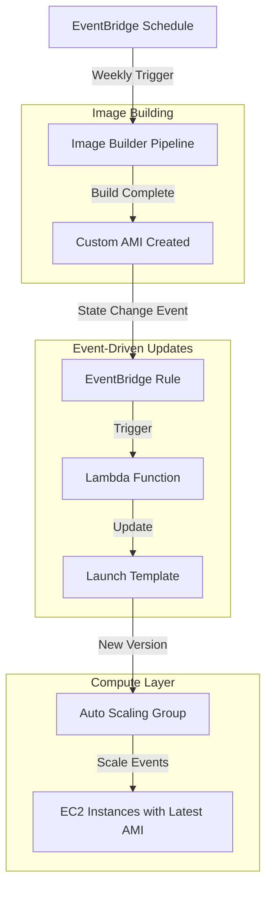

# AWS Autoscaling with EC2 Image Builder

## Table of Contents
- [Learning Objectives](#learning-objectives)
- [Architecture Overview](#architecture-overview)
- [AWS Services Used](#aws-services-used)
- [How It Works](#how-it-works)
- [Prerequisites](#prerequisites)
- [Deployment Instructions](#deployment-instructions)
- [File Structure & Purpose](#file-structure--purpose)
- [Customization Options](#customization-options)
- [Best Practices](#best-practices)
- [Troubleshooting](#troubleshooting)
- [Additional Resources](#additional-resources)

## Learning Objectives

By exploring and deploying this project, you will learn:

### Infrastructure Automation Concepts
- **Event-Driven Architecture**: Understand how AWS services communicate through EventBridge to create automated workflows
- **Infrastructure as Code**: Master Terraform patterns for complex, multi-service AWS deployments
- **Immutable Infrastructure**: Learn the benefits and implementation of treating infrastructure as disposable and reproducible

### AWS Service Integration Patterns
- **EC2 Image Builder**: Automate the creation of hardened, custom AMIs with scheduled builds and testing
- **Auto Scaling Groups**: Implement dynamic scaling with custom launch templates that automatically use the latest AMIs
- **Lambda Automation**: Build serverless functions that respond to AWS events and update infrastructure components
- **EventBridge Integration**: Create event-driven workflows that connect multiple AWS services seamlessly

### Security and Compliance
- **IAM Best Practices**: Implement least-privilege access patterns for cross-service communication
- **Encrypted Storage**: Configure encrypted EBS volumes and secure AMI distribution
- **VPC Security**: Design network isolation with proper subnet segmentation and security groups

### Operational Excellence
- **Automated Updates**: Eliminate manual AMI management through automated pipeline workflows
- **Monitoring and Logging**: Implement CloudWatch integration for pipeline visibility and troubleshooting
- **Scalable Patterns**: Design infrastructure that can grow from development to production environments

## Architecture Overview

This project demonstrates a **modern, event-driven autoscaling pattern** that automatically maintains up-to-date, hardened AMIs in your Auto Scaling Groups. The architecture eliminates manual AMI management while ensuring your instances always run the latest, security-patched images.

### Core Architecture Pattern



### Key Architectural Benefits

1. **Zero-Touch AMI Management**: Once deployed, the system automatically builds, tests, and deploys new AMIs without manual intervention
2. **Event-Driven Automation**: Uses AWS native event systems to create loosely coupled, resilient automation workflows  
3. **Immutable Infrastructure**: Promotes the practice of replacing rather than patching infrastructure components
4. **Scalable Foundation**: Provides a template that can be extended for complex, multi-environment deployments

## AWS Services Used

This architecture leverages multiple AWS services working together to create a fully automated, event-driven infrastructure pattern. Each service plays a specific role in the overall workflow.

### Core Compute Services

#### **[EC2 Image Builder](https://docs.aws.amazon.com/imagebuilder/)**
- **Role**: Automated AMI creation pipeline with built-in testing and validation
- **Key Components**:
  - **Image Recipe**: Defines the base AMI (Amazon Linux 2023) and custom components to install
  - **Infrastructure Configuration**: Specifies build environment (instance type, VPC, security groups)
  - **Distribution Configuration**: Manages AMI distribution across regions and accounts
  - **Pipeline**: Orchestrates the entire build process with scheduling capabilities
- **Automation**: Scheduled weekly builds (Tuesdays at 02:00 UTC) with automatic testing
- **Output**: Hardened, custom AMIs with consistent tooling and security configurations

#### **[Auto Scaling Groups (ASG)](https://docs.aws.amazon.com/autoscaling/)**
- **Role**: Dynamic instance management with automatic scaling based on demand
- **Integration**: Uses launch templates that automatically reference the latest AMI
- **Configuration**: Deployed across multiple AZs for high availability
- **Scaling**: Currently configured for 0-1 instances (can be adjusted for production workloads)

#### **[Launch Templates](https://docs.aws.amazon.com/AWSEC2/latest/UserGuide/ec2-launch-templates.html)**
- **Role**: Versioned instance configuration management
- **Key Features**:
  - References AMI ID from Systems Manager Parameter Store
  - Defines instance type, security groups, and IAM instance profile
  - Configures encrypted EBS volumes (20GB GP3)
  - Supports automatic versioning for seamless updates
- **Automation**: Lambda function creates new versions when AMIs are updated

### Event-Driven Automation Services

#### **[Amazon EventBridge](https://docs.aws.amazon.com/eventbridge/)**
- **Role**: Event-driven service integration and workflow orchestration
- **Key Functions**:
  - **Scheduling**: Triggers Image Builder pipeline on a weekly schedule
  - **Event Routing**: Captures Image Builder state change events and routes them to Lambda
  - **Event Pattern Matching**: Filters for "AVAILABLE" status events from successful builds
- **Integration Pattern**: Decouples services through event-driven communication

#### **[AWS Lambda](https://docs.aws.amazon.com/lambda/)**
- **Role**: Serverless automation for infrastructure updates
- **Function**: `ltupdater` - Updates launch templates when new AMIs are available
- **Key Capabilities**:
  - Retrieves latest AMI ID from Systems Manager Parameter Store
  - Creates new launch template versions with updated AMI
  - Sets new version as default for Auto Scaling Group
  - Runs in VPC for secure access to private resources
- **Runtime**: Python 3.12 with 60-second timeout

#### **[Systems Manager Parameter Store](https://docs.aws.amazon.com/systems-manager/latest/userguide/systems-manager-parameter-store.html)**
- **Role**: Secure storage and retrieval of AMI identifiers
- **Parameter**: `/imagebuilder/{project}/custom_id` stores the latest AMI ID
- **Integration**: 
  - Updated automatically by Image Builder distribution configuration
  - Read by Lambda function for launch template updates
  - Referenced by launch template for AMI selection
- **Data Type**: `aws:ec2:image` for AMI-specific validation

### Security & Networking Infrastructure

#### **[Virtual Private Cloud (VPC)](https://docs.aws.amazon.com/vpc/)**
- **Role**: Isolated network environment for all resources
- **Architecture**: 
  - **CIDR Block**: 11.0.0.0/16 (private address space)
  - **Availability Zones**: Spans 2 AZs for high availability
  - **Public Subnets**: 11.0.1.0/24, 11.0.2.0/24 (for NAT Gateway)
  - **Private Subnets**: 11.0.101.0/24, 11.0.102.0/24 (for compute resources)
- **Connectivity**: Single NAT Gateway for outbound internet access from private subnets

#### **[Security Groups](https://docs.aws.amazon.com/AWSEC2/latest/UserGuide/ec2-security-groups.html)**
- **Role**: Network-level access control and traffic filtering
- **Configurations**:
  - **Main Security Group**: HTTPS (443) ingress/egress for EC2 instances
  - **Lambda Security Group**: HTTPS (443) egress only for AWS API calls
- **Security Principle**: Minimal required access with explicit allow rules

#### **[Identity and Access Management (IAM)](https://docs.aws.amazon.com/IAM/)**
- **Role**: Least-privilege access control for cross-service communication
- **Key Roles**:
  - **Image Builder Instance Profile**: Permissions for build process and S3 access
  - **Lambda Execution Role**: EC2, SSM, and VPC permissions for launch template updates
  - **EC2 Instance Profile**: Runtime permissions for deployed instances
- **Security Pattern**: Service-specific roles with minimal required permissions

### Supporting Services

#### **[Elastic Block Store (EBS)](https://docs.aws.amazon.com/AWSEC2/latest/UserGuide/AmazonEBS.html)**
- **Role**: Encrypted storage for EC2 instances
- **Configuration**: 20GB GP3 volumes with encryption at rest
- **Integration**: Configured in launch template for consistent storage setup

#### **[CloudWatch](https://docs.aws.amazon.com/cloudwatch/)**
- **Role**: Monitoring and logging for pipeline visibility
- **Integration**: EventBridge rules use CloudWatch Events for state change detection
- **Observability**: Provides logs and metrics for troubleshooting automation workflows

## How It Works

This section provides a detailed walkthrough of the event-driven automation workflow, explaining how each AWS service contributes to the overall pattern.

### 1. Scheduled AMI Creation Pipeline

#### **Pipeline Initialization**
- **EventBridge Schedule**: Triggers the Image Builder pipeline weekly (Tuesdays at 02:00 UTC)
- **Schedule Expression**: `cron(0 2 ? * TUE *)` ensures consistent, predictable builds
- **Pipeline Status**: Enabled with enhanced metadata collection for detailed tracking

#### **Image Building Process**
1. **Infrastructure Provisioning**: Image Builder launches a temporary EC2 instance in the private subnet
2. **Base Image Selection**: Starts with the latest Amazon Linux 2023 AMI from AWS
3. **Component Installation**: Applies custom components in sequence:
   - **OS Tooling Component**: Installs essential system tools and security hardening
   - **Custom Scripts Component**: Downloads and configures project-specific tooling
4. **Image Testing**: Built-in tests validate the AMI functionality (60-minute timeout)
5. **AMI Creation**: Successful builds create a new AMI with standardized naming: `{project}-{buildDate}`

#### **Distribution and Storage**
- **AMI Distribution**: New AMI is distributed with consistent tags (OS, Hardened, Name)
- **Parameter Store Update**: AMI ID is automatically stored in `/imagebuilder/{project}/custom_id`
- **Cleanup**: Temporary build instance is terminated after successful completion

### 2. Event-Driven Launch Template Updates

#### **Event Detection and Routing**
```json
{
  "source": ["aws.imagebuilder"],
  "detail-type": ["EC2 Image Builder Image State Change"],
  "detail": {
    "state": {
      "status": ["AVAILABLE"]
    }
  }
}
```

- **EventBridge Rule**: Monitors for Image Builder state change events
- **Event Filtering**: Only processes events with "AVAILABLE" status (successful builds)
- **Lambda Trigger**: Matching events automatically invoke the `ltupdater` Lambda function

#### **Automated Launch Template Updates**
The Lambda function performs the following operations:

1. **AMI ID Retrieval**: Reads the latest AMI ID from Systems Manager Parameter Store
2. **Launch Template Versioning**: Creates a new launch template version with:
   - Updated AMI ID from the latest build
   - Consistent instance configuration (type, security groups, IAM profile)
   - Encrypted EBS volume configuration (20GB GP3)
3. **Default Version Update**: Sets the new version as the default for the Auto Scaling Group
4. **Error Handling**: Includes comprehensive error handling and logging for troubleshooting

#### **Lambda Function Environment**
- **Runtime**: Python 3.12 with optimized performance
- **VPC Integration**: Runs within private subnets for secure AWS API access
- **Environment Variables**: Configurable parameters for launch template ID, instance type, and security groups
- **Timeout**: 60-second execution limit for reliable completion

### 3. Automatic Instance Lifecycle Management

#### **Auto Scaling Group Integration**
- **Launch Template Reference**: ASG always uses the `$Latest` version of the launch template
- **Immediate Effect**: New instances automatically use the updated AMI without manual intervention
- **Multi-AZ Deployment**: Instances can be launched across multiple availability zones for resilience

#### **Instance Refresh Capabilities**
- **Manual Refresh**: Existing instances can be refreshed using ASG instance refresh features
- **Rolling Updates**: Supports gradual replacement of existing instances with new AMI
- **Zero-Downtime**: Maintains service availability during instance updates (when properly configured)

#### **Scaling Behavior**
- **Current Configuration**: 0-1 instances (suitable for development/testing)
- **Production Scaling**: Can be adjusted for higher capacity and automatic scaling policies
- **Health Checks**: EC2 health checks ensure only healthy instances remain in service

### 4. Security and Network Isolation

#### **Network Architecture**
- **VPC Isolation**: All resources operate within a dedicated VPC (11.0.0.0/16)
- **Subnet Strategy**: 
  - **Private Subnets**: Host compute resources (Image Builder, Lambda, EC2 instances)
  - **Public Subnets**: Contain NAT Gateway for controlled outbound internet access
- **Internet Connectivity**: Single NAT Gateway provides cost-effective outbound access

#### **Security Controls**
- **Security Groups**: Implement network-level access control
  - **Instance Security Group**: HTTPS (443) for AWS API communication
  - **Lambda Security Group**: Outbound HTTPS only for service calls
- **IAM Roles**: Enforce least-privilege access patterns
  - **Service-Specific Permissions**: Each service has only required permissions
  - **Cross-Service Access**: Secure communication between Lambda, SSM, and EC2 services

#### **Data Protection**
- **Encryption at Rest**: All EBS volumes use AWS-managed encryption
- **Secure Parameter Storage**: AMI IDs stored securely in Systems Manager Parameter Store
- **Network Encryption**: All AWS API calls use TLS encryption in transit

### 5. Event-Driven Architecture Benefits

#### **Loose Coupling**
- **Service Independence**: Each service operates independently with event-based communication
- **Failure Isolation**: Issues in one component don't cascade to others
- **Scalability**: Individual services can be scaled based on specific requirements

#### **Automation Reliability**
- **Consistent Execution**: Scheduled builds ensure regular AMI updates
- **Automatic Recovery**: Failed builds don't affect existing infrastructure
- **Audit Trail**: EventBridge and CloudWatch provide complete workflow visibility

#### **Operational Excellence**
- **Zero-Touch Operations**: No manual intervention required for AMI lifecycle management
- **Predictable Updates**: Scheduled builds provide consistent, testable update cycles
- **Infrastructure as Code**: Complete automation enables version control and reproducible deployments

This comprehensive automation pattern eliminates manual AMI management while ensuring your infrastructure remains current with security patches and organizational standards.
## File Structure & Purpose

This section provides detailed documentation of each Terraform file, explaining their purpose, key resources, and relationships within the overall architecture.

### Core Configuration Files

#### **`main.tf`** - Provider and Terraform Configuration
**Purpose**: Defines Terraform and AWS provider requirements with default tagging strategy

**Key Resources**:
- **Terraform Block**: Specifies minimum Terraform version (>=1.11.0) and AWS provider version (6.13.0)
- **AWS Provider**: Configures regional deployment with automatic default tagging
- **Default Tags**: Applies consistent tags (Owner, Project, Environment) to all resources

**Configuration Notes**:
- Uses variable-driven region configuration for multi-region flexibility
- Implements organization-wide tagging standards through `var.default_tags`
- Provider version pinning ensures consistent deployments across environments

**Dependencies**: None (foundational configuration file)

---

#### **`variables.tf`** - Input Variable Definitions
**Purpose**: Centralizes all configurable parameters for the infrastructure deployment

**Key Variables**:
- **`region`**: AWS deployment region (default: eu-west-1)
- **`project`**: Project identifier used in resource naming and tagging
- **`instance_type`**: EC2 instance type for Auto Scaling Group (default: t4g.small)
- **`build_instance_types`**: Array of instance types for Image Builder (Graviton-based)
- **`default_tags`**: Standard tags applied to all resources

**Configuration Notes**:
- Graviton-based instance types (t4g family) for cost optimization and performance
- Flexible build instance types support different workload requirements
- Consistent naming convention using project variable across all resources

**Dependencies**: Referenced by all other Terraform files for configuration values

---

#### **`locals.tf`** - Computed Local Values
**Purpose**: Defines dynamic values computed at runtime for use across the configuration

**Key Locals**:
- **`account_id`**: Current AWS account ID retrieved from caller identity
- **Dynamic References**: Enables account-specific resource ARN construction

**Configuration Notes**:
- Eliminates hardcoded account IDs for better portability
- Supports multi-account deployments with dynamic account resolution
- Used in IAM policies and resource ARNs requiring account-specific references

**Dependencies**: Uses `data.aws_caller_identity.current` from `data.tf`

---

#### **`data.tf`** - Data Sources and Policy Documents
**Purpose**: Retrieves external data and defines IAM policy documents for secure service communication

**Key Data Sources**:
- **`aws_caller_identity.current`**: Current AWS account information
- **`aws_ssm_parameter.al2023`**: Latest Amazon Linux 2023 ARM64 AMI ID
- **`aws_ami.al2023`**: AMI details for initial launch template configuration
- **`archive_file.ltupdater`**: Lambda deployment package creation

**IAM Policy Documents**:
- **`assume_lambda`**: Lambda service trust policy for function execution
- **`lambda_ltupdater_policy`**: Permissions for launch template updates and SSM access
- **`assume_ec2`**: EC2 and Image Builder service trust policy
- **`imagebuilder_permissions`**: Comprehensive Image Builder build permissions

**Configuration Notes**:
- Uses AWS-managed parameter for latest AMI discovery (`/aws/service/ami-amazon-linux-latest/`)
- Implements least-privilege IAM policies with specific resource access
- Supports ARM64 architecture alignment with Graviton instance types

**Dependencies**: None (provides foundational data for other resources)

---

### Networking Infrastructure

#### **`vpc.tf`** - Virtual Private Cloud Configuration
**Purpose**: Creates isolated network environment with public/private subnet architecture

**Key Resources**:
- **VPC Module**: Uses terraform-aws-modules/vpc for standardized VPC creation
- **Network Architecture**: 
  - CIDR: 11.0.0.0/16 (65,536 IP addresses)
  - Public Subnets: 11.0.1.0/24, 11.0.2.0/24 (for NAT Gateway)
  - Private Subnets: 11.0.101.0/24, 11.0.102.0/24 (for compute resources)
- **Connectivity**: Single NAT Gateway for cost-effective outbound internet access

**Configuration Notes**:
- Multi-AZ deployment across two availability zones for high availability
- Private subnets host all compute resources (EC2, Lambda, Image Builder)
- DNS resolution enabled for internal service discovery
- Single NAT Gateway reduces costs while maintaining outbound connectivity

**Dependencies**: Uses `var.region` and `var.default_tags` from variables

**Relationships**: Provides subnet IDs for security groups, Lambda, ASG, and Image Builder

---

#### **`security-group.tf`** - Network Access Control
**Purpose**: Implements network-level security controls with minimal required access

**Key Resources**:
- **`aws_security_group.MyExampleSG`**: Main security group for EC2 instances and Image Builder
  - **Ingress**: HTTPS (443) from anywhere (for AWS API access)
  - **Egress**: HTTPS (443) to anywhere (for software downloads and AWS APIs)
- **`aws_security_group.lambda`**: Lambda-specific security group
  - **Egress Only**: HTTPS (443) for AWS service communication

**Configuration Notes**:
- Follows principle of least privilege with minimal port exposure
- HTTPS-only communication ensures encrypted data in transit
- Separate security groups for different service types enable granular control
- No SSH access enforces immutable infrastructure practices

**Dependencies**: Requires VPC ID from `vpc.tf`

**Relationships**: Referenced by EC2 instances, Lambda functions, and Image Builder infrastructure

---

### Identity and Access Management

#### **`iam.tf`** - IAM Roles and Policies
**Purpose**: Implements least-privilege access control for cross-service communication

**Key Resources**:
- **`aws_iam_role.scanbox`**: EC2 instance role for deployed instances
- **`aws_iam_instance_profile.scanbox`**: Instance profile for EC2 role attachment
- **`aws_iam_role.imagebuilder_role`**: Image Builder service role with build permissions
- **`aws_iam_instance_profile.imagebuilder`**: Instance profile for Image Builder instances

**Policy Attachments**:
- **SSM Core Policy**: Enables Systems Manager agent functionality
- **Image Builder Permissions**: Custom policy for AMI creation and management
- **Lifecycle Execution Policy**: AWS-managed policy for Image Builder operations

**Configuration Notes**:
- Separate roles for different service functions (runtime vs. build)
- Instance profiles enable EC2 instances to assume IAM roles
- Follows AWS security best practices with service-specific permissions

**Dependencies**: Uses trust policies from `data.tf`

**Relationships**: Instance profiles referenced by launch templates and Image Builder configuration

---

### Image Building Pipeline

#### **`imagebuilder.tf`** - EC2 Image Builder Configuration
**Purpose**: Automates custom AMI creation with scheduled builds and testing

**Key Resources**:
- **`aws_imagebuilder_component.custom_scripts`**: Custom component for project-specific tooling
- **`aws_imagebuilder_component.os_tooling`**: OS-level hardening and tool installation
- **`aws_imagebuilder_image_recipe.custom_recipe`**: Combines base AMI with custom components
- **`aws_imagebuilder_infrastructure_configuration.infra`**: Build environment specification
- **`aws_imagebuilder_distribution_configuration.dist`**: AMI distribution and tagging
- **`aws_imagebuilder_image_pipeline.pipeline`**: Orchestrates the complete build process

**Pipeline Configuration**:
- **Schedule**: Weekly builds (Tuesdays at 02:00 UTC)
- **Base Image**: Latest Amazon Linux 2023 ARM64 from AWS Parameter Store
- **Build Environment**: Private subnet with Graviton instance types
- **Testing**: 60-minute timeout with automated validation
- **Distribution**: Automatic AMI tagging and Parameter Store updates

**Configuration Notes**:
- Component execution order: OS tooling first, then custom scripts
- Enhanced metadata collection for detailed build tracking
- Automatic cleanup of build instances on completion or failure
- Lifecycle management prevents Terraform from recreating recipes unnecessarily

**Dependencies**: Requires VPC subnets, security groups, IAM roles, and SSM parameters

**Relationships**: Outputs AMI IDs to Parameter Store, triggers EventBridge events

---

### Automation and Event Processing

#### **`lambda.tf`** - Lambda Function for Launch Template Updates
**Purpose**: Serverless automation for updating launch templates with new AMI IDs

**Key Resources**:
- **`aws_iam_role.lambda-ltupdater`**: Lambda execution role with required permissions
- **`aws_iam_policy.ltupdater-lambda_policy`**: Custom policy for EC2 and SSM access
- **`aws_lambda_function.update_launch_template`**: Python function for launch template updates
- **`aws_lambda_permission.allow_eventbridge`**: Allows EventBridge to invoke the function

**Function Configuration**:
- **Runtime**: Python 3.12 for optimal performance and security
- **Timeout**: 60 seconds for reliable completion
- **VPC Integration**: Runs in private subnets with security group restrictions
- **Environment Variables**: Configurable parameters for launch template and instance settings

**Automation Logic**:
1. Retrieves latest AMI ID from Systems Manager Parameter Store
2. Creates new launch template version with updated AMI
3. Sets new version as default for Auto Scaling Group
4. Provides detailed logging for troubleshooting

**Configuration Notes**:
- VPC deployment enables secure access to private AWS APIs
- Environment variables allow flexible configuration without code changes
- IAM policies follow least-privilege principles with specific resource access

**Dependencies**: Requires IAM policies from `data.tf`, VPC configuration, and security groups

**Relationships**: Triggered by EventBridge, updates launch templates, reads from Parameter Store

---

#### **`eventbridge.tf`** - Event-Driven Workflow Orchestration
**Purpose**: Connects Image Builder pipeline completion events to Lambda automation

**Key Resources**:
- **`aws_cloudwatch_event_rule.imagebuilder_completed`**: Captures Image Builder state change events
- **`aws_cloudwatch_event_target.trigger_lambda`**: Routes matching events to Lambda function

**Event Pattern**:
```json
{
  "source": ["aws.imagebuilder"],
  "detail-type": ["EC2 Image Builder Image State Change"],
  "detail": {
    "state": {
      "status": ["AVAILABLE"]
    }
  }
}
```

**Configuration Notes**:
- Event filtering ensures only successful builds trigger automation
- Loose coupling between Image Builder and launch template updates
- Automatic retry and error handling through EventBridge service
- Enables audit trail of all automation events

**Dependencies**: Requires Lambda function ARN for event target configuration

**Relationships**: Bridges Image Builder pipeline completion with launch template automation

---

### Compute Infrastructure

#### **`ec2-asg.tf`** - Auto Scaling Group and Launch Template
**Purpose**: Manages scalable compute infrastructure with automated AMI updates

**Key Resources**:
- **`aws_launch_template.custom_lt`**: Versioned instance configuration template
- **`aws_autoscaling_group.custom_asg`**: Auto Scaling Group for dynamic instance management

**Launch Template Configuration**:
- **AMI Reference**: Uses Parameter Store value for automatic updates
- **Instance Type**: Configurable Graviton-based instances (t4g.small default)
- **Security**: VPC security groups and IAM instance profile
- **Storage**: 20GB encrypted GP3 EBS volume
- **Tagging**: Consistent resource tagging for management and billing

**Auto Scaling Group Settings**:
- **Capacity**: 0-1 instances (configurable for production workloads)
- **Multi-AZ**: Deploys across private subnets in multiple availability zones
- **Health Checks**: EC2-based health monitoring with 300-second grace period
- **Launch Template**: Always uses `$Latest` version for automatic AMI updates

**Configuration Notes**:
- Launch template versioning enables zero-downtime AMI updates
- Encrypted storage ensures data protection at rest
- Instance tagging propagation maintains consistent resource identification
- Health check configuration balances responsiveness with stability

**Dependencies**: Requires Parameter Store AMI ID, VPC subnets, security groups, and IAM instance profile

**Relationships**: Uses AMI IDs from Parameter Store, updated by Lambda function automation

---

### Parameter Management

#### **`ssm.tf`** - Systems Manager Parameter Store
**Purpose**: Secure storage and management of AMI identifiers for automated updates

**Key Resources**:
- **`aws_ssm_parameter.custom_built_custom_id`**: Parameter storing latest custom AMI ID

**Parameter Configuration**:
- **Name**: `/imagebuilder/{project}/custom_id` (hierarchical naming)
- **Type**: String with `aws:ec2:image` data type for AMI validation
- **Initial Value**: Base Amazon Linux 2023 AMI ID for first deployment
- **Lifecycle Management**: Terraform ignores value changes (managed by Image Builder)

**Integration Points**:
- **Image Builder**: Automatically updates parameter value on successful builds
- **Launch Template**: References parameter for AMI selection
- **Lambda Function**: Reads parameter for launch template updates

**Configuration Notes**:
- Data type validation ensures only valid AMI IDs are stored
- Lifecycle policy prevents Terraform from overwriting Image Builder updates
- Hierarchical naming supports multiple projects and environments
- Secure parameter access through IAM policies

**Dependencies**: Uses base AMI data source for initial value

**Relationships**: Central integration point for AMI lifecycle management across all services

---

### Component Relationships and Data Flow

#### **Build Pipeline Flow**
1. **EventBridge Schedule** → **Image Builder Pipeline** (weekly trigger)
2. **Image Builder** → **Parameter Store** (AMI ID update)
3. **Image Builder** → **EventBridge Event** (state change notification)
4. **EventBridge Rule** → **Lambda Function** (event-driven trigger)
5. **Lambda Function** → **Launch Template** (version update)

#### **Runtime Infrastructure Flow**
1. **Launch Template** → **Parameter Store** (AMI ID reference)
2. **Auto Scaling Group** → **Launch Template** (instance configuration)
3. **EC2 Instances** → **IAM Instance Profile** (runtime permissions)
4. **All Resources** → **VPC/Security Groups** (network isolation)

#### **Security and Access Flow**
1. **IAM Roles** → **Service Trust Policies** (service authentication)
2. **IAM Policies** → **AWS APIs** (resource access control)
3. **Security Groups** → **Network Traffic** (network-level filtering)
4. **Parameter Store** → **IAM Permissions** (secure configuration access)

This comprehensive file structure creates a fully automated, event-driven infrastructure pattern that eliminates manual AMI management while maintaining security, scalability, and operational excellence.

## Event-Driven Automation Workflow

This section provides deep technical details about the event-driven patterns and automation workflows that make this architecture fully autonomous.

### EventBridge Integration Patterns

#### **Schedule-Based Triggers**
```hcl
schedule {
  schedule_expression                = "cron(0 2 ? * TUE *)"
  pipeline_execution_start_condition = "EXPRESSION_MATCH_ONLY"
}
```

- **Cron Expression**: `0 2 ? * TUE *` (02:00 UTC every Tuesday)
- **Execution Condition**: `EXPRESSION_MATCH_ONLY` ensures builds only occur on schedule
- **Timezone**: UTC for consistent global execution regardless of regional settings
- **Frequency**: Weekly builds balance security currency with resource costs

#### **State Change Event Processing**
The EventBridge rule captures specific Image Builder events:

```json
{
  "source": ["aws.imagebuilder"],
  "detail-type": ["EC2 Image Builder Image State Change"],
  "detail": {
    "state": {
      "status": ["AVAILABLE"]
    },
    "name": "project-name-pipeline",
    "outputResources": {
      "amis": [
        {
          "region": "us-east-1",
          "image": "ami-xxxxxxxxx",
          "name": "project-name-2024-01-15T02-30-45-000Z"
        }
      ]
    }
  }
}
```

**Event Attributes**:
- **Source**: `aws.imagebuilder` identifies the service origin
- **Detail Type**: Specific to Image Builder state changes
- **Status Filter**: Only "AVAILABLE" status triggers downstream actions
- **Output Resources**: Contains new AMI details for processing

### Lambda Automation Function

#### **Function Architecture**
```python
def handler(event, context):
    # Extract AMI ID from EventBridge event
    ami_id = extract_ami_from_event(event)
    
    # Retrieve current launch template configuration
    current_config = get_launch_template_config()
    
    # Create new version with updated AMI
    new_version = create_launch_template_version(ami_id, current_config)
    
    # Set as default version for ASG
    update_default_version(new_version)
    
    return {"statusCode": 200, "message": "Launch template updated successfully"}
```

#### **Environment Configuration**
The Lambda function uses environment variables for flexible configuration:

- **`SSM_PARAM_NAME`**: `/imagebuilder/{project}/custom_id` - Parameter Store location
- **`LAUNCH_TEMPLATE_ID`**: Target launch template for updates
- **`INSTANCE_TYPE`**: EC2 instance type for new versions
- **`SECURITY_GROUP_ID`**: Security group for instance network access
- **`IAM_INSTANCE_PROFILE`**: IAM profile for EC2 instance permissions

#### **VPC Integration**
```hcl
vpc_config {
  subnet_ids         = module.vpc.private_subnets
  security_group_ids = [aws_security_group.lambda.id]
}
```

- **Private Subnet Deployment**: Lambda runs in private subnets for security
- **Security Group**: Allows HTTPS outbound for AWS API calls only
- **NAT Gateway Access**: Enables secure internet access for AWS service communication

### Systems Manager Parameter Store Integration

#### **Parameter Configuration**
```hcl
resource "aws_ssm_parameter" "custom_built_custom_id" {
  name        = "/imagebuilder/${var.project}/custom_id"
  description = "SSM Parameter for storing the AMI ID of the image built from Image Builder"
  type        = "String"
  data_type   = "aws:ec2:image"
  value       = data.aws_ami.al2023.id
  
  lifecycle {
    ignore_changes = [value]
  }
}
```

**Key Features**:
- **Data Type**: `aws:ec2:image` provides AMI-specific validation
- **Lifecycle Management**: Terraform ignores value changes (managed by Image Builder)
- **Initial Value**: Set to base Amazon Linux 2023 AMI for first deployment
- **Automatic Updates**: Image Builder distribution configuration updates the value

#### **Cross-Service Communication**
1. **Image Builder → Parameter Store**: Distribution configuration automatically updates parameter
2. **Parameter Store → Lambda**: Function retrieves latest AMI ID for launch template updates
3. **Parameter Store → Launch Template**: Template references parameter for AMI selection

### Launch Template Versioning Strategy

#### **Version Management**
```hcl
launch_template {
  id      = aws_launch_template.custom_lt.id
  version = "$Latest"
}
```

- **Automatic Versioning**: Lambda creates new versions for each AMI update
- **Default Version**: New versions automatically become the default
- **ASG Integration**: Auto Scaling Group always uses `$Latest` version
- **Rollback Capability**: Previous versions remain available for emergency rollback

#### **Configuration Consistency**
Each new launch template version maintains:
- **Instance Type**: Consistent across all versions
- **Security Groups**: Same network access patterns
- **IAM Instance Profile**: Unchanged permissions model
- **EBS Configuration**: Consistent storage settings (encrypted, GP3, 20GB)
- **Tags**: Standardized tagging for resource management

### Image Builder Pipeline Automation

#### **Component Management**
```hcl
component { component_arn = aws_imagebuilder_component.os_tooling.arn }
component { component_arn = aws_imagebuilder_component.custom_scripts.arn }
```

**Component Execution Order**:
1. **OS Tooling Component**: System-level hardening and tool installation
2. **Custom Scripts Component**: Application-specific configuration and tooling

#### **Build Infrastructure**
```hcl
resource "aws_imagebuilder_infrastructure_configuration" "infra" {
  instance_types                = var.build_instance_types
  subnet_id                     = module.vpc.private_subnets[0]
  security_group_ids            = [aws_security_group.MyExampleSG.id]
  terminate_instance_on_failure = true
}
```

**Security Features**:
- **Private Subnet**: Build instances run in isolated network environment
- **Automatic Cleanup**: Failed builds automatically terminate instances
- **Security Groups**: Minimal network access for build process
- **Instance Profile**: Least-privilege permissions for build operations

#### **Testing and Validation**
```hcl
image_tests_configuration {
  image_tests_enabled = true
  timeout_minutes     = 60
}
```

- **Automated Testing**: Built-in tests validate AMI functionality before distribution
- **Timeout Protection**: 60-minute limit prevents runaway build processes
- **Quality Gates**: Only tested, validated AMIs trigger downstream automation

### Error Handling and Resilience

#### **Lambda Function Resilience**
- **Timeout Configuration**: 60-second limit ensures timely completion
- **Error Logging**: CloudWatch logs capture detailed error information
- **Retry Logic**: EventBridge provides automatic retry for failed invocations
- **Dead Letter Queue**: Can be configured for failed event processing

#### **Pipeline Failure Handling**
- **Build Failures**: Failed Image Builder runs don't trigger Lambda updates
- **Event Filtering**: Only successful builds ("AVAILABLE" status) proceed
- **Infrastructure Isolation**: Build failures don't affect running instances
- **Rollback Capability**: Previous AMI versions remain available

#### **Monitoring and Observability**
- **CloudWatch Integration**: All services provide detailed metrics and logs
- **EventBridge Metrics**: Track event processing success rates
- **Lambda Metrics**: Monitor function execution and error rates
- **Image Builder Logs**: Detailed build process logging for troubleshooting

This event-driven architecture provides a robust, scalable foundation for automated infrastructure management while maintaining security, reliability, and operational excellence.